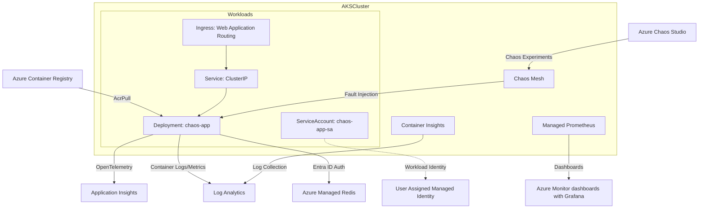

# 壊して学ぼうAKS

このリポジトリは、Azure Kubernetes Service (AKS) の構造や回復機能を実際に試して学びたい方のための実験環境です。

`azd up` コマンド一つで、以下がすべて自動セットアップされます：
- 🏗️ **本格的なAKS環境** - 高可用性構成、自動スケーリング、ネットワークポリシー完備
- 🚀 **サンプルアプリケーション** - 外部依存要素(Redis)、ヘルスチェック、リトライ機能を実装済み
- 💥 **Azure Chaos Studio** - 7種類の障害シナリオをワンクリックで注入
- 📊 **Locust負荷生成ツール** - 実際の負荷下での挙動を観察
- 🔍 **可観測性ツール群** - Application Insights、Prometheus、Grafanaで障害時の詳細を可視化

**なぜこのラボが必要？**
- Kubernetesの自己修復機能を実際に見て理解できる
- 障害発生時のアプリケーションの振る舞いを安全に学習
- 本番環境で使える回復パターンを実験的に習得
- パラメータを自由に変更して、限界値や最適値を探索

さあ、AKSで動くアプリケーションを壊して、その回復力を目の当たりにしましょう！また、救えないケースがあることも知りましょう！

## 🌟 主な機能

- **Advanced Container Networking**: L7ネットワークポリシーと可観測性
- **Azure Managed Redis + Entra ID認証**: パスワードレスでセキュアなデータストア接続  
- **Workload Identity**: OIDC ベースの最新Azure認証方式
- **Azure AD統合とローカルアカウント無効化**: Entra IDのみの認証を強制し、アイデンティティガバナンスと監査性を向上
- **Container Insights**: AMA + DCR による統合監視（Log Analytics 連携）
- **Azure Chaos Studio**: AKS向けChaos Mesh実験（Kernel を除く主要7種類）対応による包括的障害注入
- **自動スケーリング**: ノード自動スケーリング (Base: Cluster Autoscaler、Automatic: Node Auto Provisioning) + HPA
- **自動アップグレード**: スケジュール指定可能な自動更新とアラート通知

## ドキュメント
- 要件: docs/requirements.md
- 設計: docs/design.md
- デプロイ: docs/deployment.md
- API: docs/api.md

## 🚀 クイックスタート

### 前提条件
- **動作環境**: Linux (WSL) または macOS
- [Azure Developer CLI (azd)](https://learn.microsoft.com/azure/developer/azure-developer-cli/) **推奨**
- Azure CLI + Bicep extension
- **アドオンのVPAによるコスト最適化機能**: `aks-preview` 拡張機能 + プレビュー機能フラグ `AKS-AddonAutoscalingPreview` の登録が必要
  ```bash
  # aks-preview拡張機能のインストール
  az extension add --name aks-preview
  az extension update --name aks-preview
  
  # プレビュー機能の登録
  az feature register --namespace "Microsoft.ContainerService" --name "AKS-AddonAutoscalingPreview"
  az feature show --namespace "Microsoft.ContainerService" --name "AKS-AddonAutoscalingPreview"
  az provider register --namespace Microsoft.ContainerService
  ```
- kubectl  
- Python 3.13+ + [uv](https://github.com/astral-sh/uv)

### デプロイメント

本リポジトリは**AKS Base**モードと**AKS Automatic**モードの両方をサポートしています。パラメーターファイル（`infra/main.parameters.json`）で`aksSkuName`を変更することで選択可能です：

- **Base** (デフォルト): 従来のAKSで、詳細な制御が可能
- **Automatic**: より自動化された運用を提供する新しいAKSモード

[Azure Kubernetes Service \(AKS\) Automatic の概要 \- Azure Kubernetes Service \| Microsoft Learn](https://learn.microsoft.com/ja-jp/azure/aks/intro-aks-automatic)

> **注意**: AKS Automatic モードは現在一時的に無効化されています。解決に時間を要する可能性が高いため、Base モードのみをご利用ください。詳細は [Issue #25](https://github.com/torumakabe/aks-chaos-lab/issues/25) をご参照ください。

Base モードを選んだ場合は、Azure Kubernetes Fleet Manager が更新管理を担います。
- Fleet フリート／メンバー／更新戦略／自動アップグレード プロファイルが `infra/modules/fleet.bicep` で自動作成されます。
- 更新戦略は `beforeGates` に Approval ゲートを含み、手動承認が完了するまで Update Run は開始されません。
- Control plane 用（Stable／`nodeImageSelection=Latest`）と NodeImage 用（`nodeImageSelection` 省略）の autoUpgradeProfile を生成し、双方が同じ承認ゲートを共有します。
- Azure Monitor の Scheduled Query Rule `fleet-approval-pending` が作成され、Approval Gate が Pending の間アクション グループに通知します。
- CLI からの承認例：
  ```bash
  az extension add --name fleet
  az fleet gate list \
    --resource-group rg-aks-chaos-lab-dev \
    --fleet-name fleet-aks-chaos-lab-dev \
    --state Pending
  az fleet gate approve \
    --resource-group rg-aks-chaos-lab-dev \
    --fleet-name fleet-aks-chaos-lab-dev \
    --gate-name <gate-name>
  ```
  > リソース名はパラメータ（`appName`, `environment`）に応じて読み替えてください。

**推奨: Azure Developer CLI**
```bash
# 初回セットアップ
# alpha機能（Helm/Kustomize）を有効化
azd config set alpha.aks.kustomize on
azd config set alpha.aks.helm on
azd init
azd up
```

**代替: Bicep直接デプロイ（サブスクリプション スコープ）**
```bash
# リソースグループはテンプレートが作成します。事前作成は不要です。
az deployment sub create \
  --location japaneast \
  --template-file infra/main.bicep \
  --parameters location=japaneast

# 生成されたリソースグループ名の例: rg-aks-chaos-lab-dev
# AKS への接続
az aks get-credentials \
  --resource-group rg-aks-chaos-lab-dev \
  --name aks-aks-chaos-lab-dev
```

詳細は [docs/deployment.md](docs/deployment.md) を参照

### ローカル開発
```bash
cd src
uv sync --group dev
uv run uvicorn app.main:app --reload --host 0.0.0.0 --port 8000
```

### テスト実行
```bash
cd src
make test            # 単体テスト
make test-cov        # カバレッジレポート生成（htmlcov/）
make lint            # リント（ruff）
make typecheck       # 型チェック（mypy）
make qa              # リント+テスト+型チェック 一括
```

### 環境削除
```bash
# Azure Developer CLI（推奨）
azd down
```

> **⚠️ 注意**: `azd down`は依存関係を考慮せずに並列でリソースグループを削除しようとするため、Azure Monitor Workspace（AMW）と、AMWが管理するリソースグループの削除順序が不適切になり、DenyAssignmentAuthorizationFailedエラーで失敗する場合があります。  
> この問題が発生した場合は、以下いずれかの方法で対処してください：
> - **再実行**: `azd down`を再度実行
> - **手動削除**: Azure CLIで直接削除 `az group delete --name <主リソースグループ名>`
> 
> 詳細: azdは削除時にBicepの依存関係定義を参照せず、Azure Resource Manager APIによる依存関係を考慮した削除も行いません。

## 📈 負荷テスト

- `src/` ディレクトリで `make` ターゲットを使って、Locust ベースの負荷を生成できます（`uv` と `kubectl` が必要）。
- `BASE_URL` 未指定時は `AZURE_INGRESS_FQDN` を優先し自動検出、未設定の場合は Ingress から自動検出します。

```bash
cd src

# smoke（軽量・クイック検証）
make load-smoke

# baseline（デフォルト）
make load-baseline

# stress / spike プロファイル
make load-stress
make load-spike

# 手動で BASE_URL 指定（他のパラメータも同様に上書き可）
BASE_URL=http://<host-or-ip> make load-baseline
USERS=100 SPAWN_RATE=10 DURATION=300 make load-baseline
```

- 推奨: 実運用に近い検証のため、負荷をかけながら Azure Chaos Studio の実験を実行してください（例: 別ターミナルで `make load-baseline` を継続しつつ、PodChaos/NetworkChaos を開始）。

## 🏗️ アーキテクチャ



- **FastAPI** アプリケーション（Python 3.13）
- **Azure Managed Redis** with Entra ID認証
- **OpenTelemetry** → Application Insights統合  
- **Azure CNI Overlay + Cilium** データプレーン
- **Advanced Container Networking** (L7ポリシー + 可観測性)
- **Container Insights** → AMA + DCR で Log Analytics 統合

詳細な設計は [docs/design.md](docs/design.md) を参照

## 🔭 可観測性

本リポジトリでは、可観測性向上ツールを設定していますのでご活用ください（Bicep/azd により有効化・構成されます）。

- Application Insights（トレース/ログ/メトリクス）: アプリ側の OpenTelemetry 設定済み（`APPLICATIONINSIGHTS_CONNECTION_STRING`）。
- Azure Monitor managed Prometheus: AMA のアノテーションスクレイプ設定（`k8s/observability/*`）と収集パイプライン/ワークスペースを IaC で構成。
  - Prometheusレコーディング/アラート ルール: `infra/modules/prometheus/recording-rules.bicep` / `alert-rules.bicep`
  - **注記**: ノード関連メトリクスは環境作成直後に収集されないことがあります。これはnode exporterのインストールが他のタスクより優先度が低いためです。最大24時間待つと導入されます。詳細: [Azure/prometheus-collector#483](https://github.com/Azure/prometheus-collector/issues/483)
- Grafana ダッシュボード: Azure Portal の 対象AKS > Monitoring > Dashboards with Grafana から参照できます。
- Container Insights: AMA + DCR（`azureMonitorProfile.containerInsights` と DCR/DCRA）によりコンテナログ/メトリクスを収集。

詳細は [docs/deployment.md](docs/deployment.md) / [docs/design.md](docs/design.md) を参照してください。

## 🔥 Chaos実験（Azure Chaos Studio）

### 利用可能な実験
| 実験種類 | 障害内容 | 実験リソース名 |
|---|---|---|
| **PodChaos** | Pod障害（unavailable） | `exp-aks-pod-failure` |
| **NetworkChaos** | ネットワーク遅延 | `exp-aks-network-delay` |
| **NetworkChaos** | ネットワーク停止（ブラックホール/100% loss） | `exp-aks-network-loss` |
| **StressChaos** | CPU/メモリストレス | `exp-aks-stress` |
| **IOChaos** | ファイルI/O遅延 | `exp-aks-io` |
| **TimeChaos** | システム時刻操作 | `exp-aks-time` |
| **HTTPChaos** | HTTP通信障害 | `exp-aks-http` |
| **DNSChaos** | DNS解決障害 | `exp-aks-dns` |

注意: Chaos Mesh の既知不具合により KernelChaos は現時点では除外しています。詳細: https://github.com/chaos-mesh/chaos-mesh/issues/4059

### 実験実行
Azure Portal → Chaos Studio または Azure CLI で実行
```bash
# 例: Pod障害実験（開始/停止）
az rest --method post \
  --url "/subscriptions/{subscription-id}/resourceGroups/{rg}/providers/Microsoft.Chaos/experiments/exp-aks-pod-failure/start?api-version=2024-01-01"

az rest --method post \
  --url "/subscriptions/{subscription-id}/resourceGroups/{rg}/providers/Microsoft.Chaos/experiments/exp-aks-pod-failure/stop?api-version=2024-01-01"
```

## ライセンス
MIT
