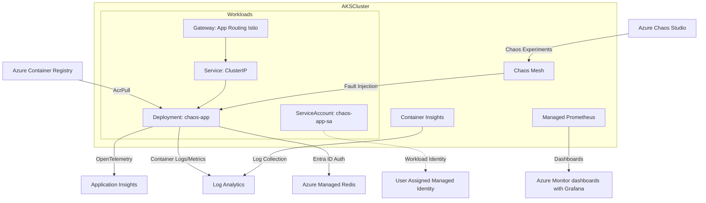

# 壊して学ぼうAKS

このリポジトリは、Azure Kubernetes Service (AKS) の構造や回復機能を実際に試して学びたい方のための実験環境です。

`azd up` コマンド一つで、以下がすべて自動セットアップされます：
- 🏗️ **本格的なAKS環境** - 高可用性構成、自動スケーリング、ネットワークポリシー完備
- 🚀 **サンプルアプリケーション** - 外部依存要素(Redis)、ヘルスチェック、リトライ機能を実装済み
- 💥 **Azure Chaos Studio** - 8種類の障害シナリオをワンクリックで注入
- 📊 **Locust負荷生成ツール** - 実際の負荷下での挙動を観察
- 🔍 **可観測性ツール群** - Application Insights、Prometheus、Grafanaで障害時の詳細を可視化

**なぜこのラボが必要？**
- Kubernetesの自己修復機能を実際に見て理解できる
- 障害発生時のアプリケーションの振る舞いを安全に学習
- 本番環境で使える回復パターンを実験的に習得
- パラメータを自由に変更して、限界値や最適値を探索

さあ、AKSで動くアプリケーションを壊して、その回復力を目の当たりにしましょう！また、救えないケースがあることも知りましょう！

## 🌟 主な機能

- **Advanced Container Networking**: L7ネットワークポリシーと可観測性
- **Azure Managed Redis + Entra ID認証**: パスワードレスでセキュアなデータストア接続  
- **Workload Identity**: OIDC ベースの最新Azure認証方式
- **Azure AD統合とローカルアカウント無効化**: Entra IDのみの認証を強制し、アイデンティティガバナンスと監査性を向上
- **Container Insights**: AMA + DCR による統合監視（Log Analytics 連携）
- **Azure Chaos Studio**: AKS向けChaos Mesh実験（Kernel を除く主要8種類）対応による包括的障害注入
- **自動スケーリング**: ノード自動スケーリング (Cluster Autoscaler) + HPA
- **自動アップグレード**: スケジュール指定可能な自動更新とアラート通知

## ドキュメント
- AI コンテキスト（Priming Document）: .github/copilot-instructions.md
- フィーチャーコンテキストガイド: docs/feature-context-guide.md

## 🚀 クイックスタート

### 前提条件
- **動作環境**: Linux (WSL) または macOS
- [Azure Developer CLI (azd)](https://learn.microsoft.com/azure/developer/azure-developer-cli/)
- Azure CLI + Bicep extension
- **アドオンのVPAによるコスト最適化機能**: `aks-preview` 拡張機能 + プレビュー機能フラグ `AKS-AddonAutoscalingPreview` の登録が必要
  ```bash
  # aks-preview拡張機能のインストール
  az extension add --name aks-preview
  az extension update --name aks-preview
  
  # プレビュー機能の登録
  az feature register --namespace "Microsoft.ContainerService" --name "AKS-AddonAutoscalingPreview"
  az feature show --namespace "Microsoft.ContainerService" --name "AKS-AddonAutoscalingPreview"
  az provider register --namespace Microsoft.ContainerService
  ```
- kubectl  
- Python 3.13+ + [uv](https://github.com/astral-sh/uv)

### 必要なロール

`azd up` を実行する identity (ユーザー / Service Principal) には、サブスクリプション スコープに加え、Azure Monitor SLI を有効化する場合は **テナント レベルの Service Group スコープ** にも RBAC 権限が必要です。Service Group / SLI はサブスクリプションを超えるリソースのため、サブスクリプション Owner だけでは作成できません。

#### 1. サブスクリプション スコープ

- **Owner** (推奨)、または **Contributor** + **User Access Administrator** の組み合わせ。
  - リソース作成と、UAMI / AKS / Chaos Studio / AMW / DCR への RBAC 付与に必要な `Microsoft.Authorization/roleAssignments/write` を満たします。

#### 2. Service Group スコープ (テナント レベル, Azure Monitor SLI を使う場合のみ)

Azure Monitor SLI は Service Group に紐づくテナントレベル リソースであり、サブスクリプション スコープの Owner だけでは作成できません。Service Group の親子関係は Azure RBAC のリソース ID パス継承と独立しているため、新しく作る環境別 Service Group には別途 role assignment が必要です。

- 既定構成 (`enableAzureMonitorSli=true`): tenant root の Service Group 配下に環境別 Service Group を作成。tenant root Service Group 上で Service Group の作成 / 子リソース管理ができる権限が必要です。
- 別の親 Service Group を使う場合: `AZURE_MONITOR_SLI_PARENT_SERVICE_GROUP_ID` / `azureMonitorSliParentServiceGroupId` で指定し、その親 Service Group 上で Service Group の作成 / 子リソース管理ができる権限を持つこと。
- 既存の環境別 Service Group を再利用する場合: `AZURE_MONITOR_SLI_SERVICE_GROUP_RESOURCE_ID` / `azureMonitorSliServiceGroupResourceId` で指定し、その Service Group で SLI 作成 (`Microsoft.Monitor/slis/write`) ができる権限を持つこと。
- `eval` 環境で SLI 作成が成功した実績のある最小構成は、**環境別 Service Group に対する `Service Group Administrator`** ロールを直接付与する形でした。親 Service Group の Contributor だけでは継承されないため、新規 Service Group には別途 role assignment を行うか、上位スコープの `Service Group Administrator` を保持してください。

#### 3. SLI 用 User Assigned Managed Identity に Bicep が自動付与するロール

`infra/modules/azmonitor/sli-rbac.bicep` および `sli-managed-dcr-rbac.bicep` が、SLI 用 UAMI に以下を自動付与します。デプロイ主体に上記 1 のサブスクリプション スコープ権限があれば、追加操作は不要です。

- Azure Monitor Workspace (本体): Monitoring Reader / Monitoring Data Reader / Monitoring Metrics Publisher
- Prometheus pipeline DCR: Monitoring Reader / Monitoring Metrics Publisher
- AMW managed resource group `MA_<amw-name>_<region>_managed` 内の同名 DCR: Monitoring Metrics Publisher

managed DCR で `Monitoring Metrics Publisher` が不足すると、SLI の storage location validation が失敗します。

#### 4. AKS の Microsoft Entra 統合

AKS は `aadProfile.managed=true` + `enableAzureRbac=true` + `disableLocalAccounts=true` のため、kubectl は Microsoft Entra ID 経由になります。Bicep が deployment 実行 identity に **Azure Kubernetes Service RBAC Cluster Admin** を付与するため、追加のテナント権限は不要です。

### プレビュー機能とリソースプロバイダー登録

ロールとは別に、サブスクリプション単位で以下のプレビュー機能とリソースプロバイダーを `azd up` 前に登録しておく必要があります（登録には Owner / Contributor 相当の権限が必要）。

```bash
# AKS のアドオン VPA
az feature register --namespace Microsoft.ContainerService --name AKS-AddonAutoscalingPreview

# OTLP 経由の Application Insights / Azure Monitor managed Prometheus 連携 (ADR-006)
az feature register --namespace Microsoft.ContainerService --name AzureMonitorAppMonitoringPreview
az feature register --namespace Microsoft.ContainerService --name AKS-OMSAppMonitoring
az feature register --namespace Microsoft.Insights --name OtlpApplicationInsights

# 反映後に provider を再登録
az provider register --namespace Microsoft.ContainerService
az provider register --namespace Microsoft.Insights
```

`az feature show --namespace <ns> --name <name>` で `state: Registered` になってから `azd up` を実行してください。

### デプロイメント

本リポジトリは **AKS Base** モード前提で動作します。Chaos Engineering を中核機能とするラボの目的上、AKS Automatic は Deployment Safeguards が chaos-mesh の必須権限 (SYS_PTRACE / NET_ADMIN / privileged container / 第三者イメージの HostPath) を全面拒否するため非サポートとしています。詳細は [ADR-010](docs/adr/010-aks-automatic-unsupported-due-to-deployment-safeguards.md) を参照してください。

`infra/main.parameters.json` の `aksSkuName` (および環境変数 `AKS_SKU_NAME`) は `Base` のみ受け付けます。誤って `Automatic` を設定した場合は Bicep validation 段階で `Allowed values are: 'Base'` のエラーで早期に拒否されます。

Azure Kubernetes Fleet Manager が更新管理を担います。
- Fleet フリート／メンバー／更新戦略／自動アップグレード プロファイルが `infra/modules/fleet.bicep` で自動作成されます。
- 更新戦略は `beforeGates` に Approval ゲートを含み、手動承認が完了するまで Update Run は開始されません。
- Control plane 用（Stable／`nodeImageSelection=Latest`）と NodeImage 用（`nodeImageSelection` 省略）の autoUpgradeProfile を生成し、双方が同じ承認ゲートを共有します。
- Azure Monitor の Scheduled Query Rule `fleet-approval-pending` が作成され、Approval Gate が Pending の間アクション グループに通知します。
- CLI からの承認例：
  ```bash
  az extension add --name fleet
  az fleet gate list \
    --resource-group rg-aks-chaos-lab-dev \
    --fleet-name fleet-aks-chaos-lab-dev \
    --state Pending
  az fleet gate approve \
    --resource-group rg-aks-chaos-lab-dev \
    --fleet-name fleet-aks-chaos-lab-dev \
    --gate-name <gate-name>
  ```
  > リソース名はパラメータ（`appName`, `environment`）に応じて読み替えてください。

デプロイは Azure Developer CLI を使います。

```bash
# 初回セットアップ
# alpha機能（Helm/Kustomize）を有効化
azd config set alpha.aks.kustomize on
azd config set alpha.aks.helm on
azd init
azd up
```

> **💡 初回 `azd up` の timeout 推奨**: 新規 AMW の recording rule cold-start が最大 ~32 分かかるため、初回 `azd up` 時に `AZD_DEPLOY_TIMEOUT=3600`（60 分）を設定することを推奨します。デフォルトの 20 分では `provision sli` 段階でタイムアウトする可能性があります。
> ```bash
> AZD_DEPLOY_TIMEOUT=3600 azd up
> ```
> 詳細は [docs/workarounds.md §A-6](docs/workarounds.md#a-6-初回-azd-up-で-azd_deploy_timeout3600-を推奨)。

`azd up` は `azure.yaml` の `workflows.up` に従い、以下の順で実行されます。

1. `azd provision base` (`infra/main.bicep`) — VNet / AKS / Redis / Application Insights / Managed Prometheus / Service Group / SLI 用 Managed Identity / RBAC を作成。
2. `azd deploy api` — chaos-app デプロイ。
3. `azd deploy observability` — Envoy Gateway などを deploy。`postdeploy` hook で `scripts/warm-up-sli-signals.sh` がトラフィック生成と Managed Prometheus recording rules の `cluster_name` 出現を待機。
4. `azd deploy chaos-mesh` — Chaos Mesh の Helm install。
5. `azd provision sli` (`infra/sli/main.bicep`) — Azure Monitor SLI definitions と SLI metric alerts を作成。

Azure Monitor SLI は作成時点で Managed Prometheus 入力メトリクスの `cluster_name` dimension を要求するため、`provision sli` は必ず warm-up 後に実行する必要があります。`infra.layers` で `base` と `sli` を分離し、`workflows.up` で順序を宣言することでこの制約を構造的に強制しています。

```bash
azd provision base --preview
# warm-up / アプリ deploy 後、SLI finalize の差分を見る場合
azd provision sli --preview
```

詳細はクイックスタートの手順を参照

### ローカル開発
```bash
cd src
uv sync --group dev
uv run uvicorn app.main:app --reload --host 0.0.0.0 --port 8000
```

### テスト実行
```bash
cd src
make test            # 単体テスト
make test-cov        # カバレッジレポート生成（htmlcov/）
make lint            # リント（ruff）
make typecheck       # 型チェック（ty）
make qa              # リント+テスト+型チェック 一括
```

### 環境削除
```bash
# Azure Developer CLI（Azure Monitor SLI cleanup hook を有効化）
CONFIRM_DELETE_AZURE_MONITOR_SLI_RESOURCES=true azd down --force --purge
```

Azure Monitor SLI を有効化した環境では、Service Group scope の `Microsoft.Monitor/slis` と環境別 Service Group が resource group の外に存在するため、通常の `azd down` だけでは消えません。このリポジトリでは `predown` hook で削除順序を補正します。

- `predown`: Service Group scope の `Microsoft.Monitor/slis`、環境別 Service Group、AKS の OTLP Application Insights DCR association を削除する。AKS 残存中に DCRA を明示削除しておくことで、後続の `postdown` force-delete が AKS 残骸の影響を受けない defense-in-depth を提供する。続いて SLI layer の sub-scope deployment record (`tags.azd-layer-name=sli`) を削除し、`azd down` の SLI layer 段階で `CompletedDeployments` が `ErrDeploymentsNotFound` を返すようにする。さらに base RG (`AZURE_RESOURCE_GROUP` 出力。fallback で `rg-aks-chaos-lab-<env>`) を `az group delete --no-wait` + `az group exists` polling で同期削除し、base layer の sub-scope deployment record (`tags.azd-layer-name=base`) も削除する。これにより `azd down` 本体は両 layer で graceful path に分岐し、`voidSubscriptionDeploymentState` が呼ばれず subscription scope void deployment の polling 404 を構造的に予防する。
- `postdown`: `azd down` 完了後に `forceDeletionResourceTypes=Microsoft.Insights/dataCollectionEndpoints,Microsoft.Insights/dataCollectionRules` を指定した RG-scope DELETE で App Insights managed resource group (`ai_<appi-name>_<guid>_managed`) を直接削除する。OTLP 有効化 App Insights では parent App Insights 削除時の cascade が deny assignment で必ず失敗し、managed RG が orphan として残るため。`azd-env-name` タグで環境別に絞り込み、他環境の managed RG を巻き込まない。

hook cleanup は削除の明示確認がある場合だけ実行します。`CONFIRM_DELETE_AZURE_MONITOR_SLI_RESOURCES=true` を付けない通常の `azd down` では skip されます。

> **⚠️ 注意**: `predown` / `postdown` hook は system-protected deny assignment を解除しません。`postdown` の force-delete は ARM の RG-level DELETE が deny assignment を回避する挙動 ([Microsoft Learn: Managed workspaces in Application Insights](https://learn.microsoft.com/azure/azure-monitor/app/managed-workspaces)) に依存しています。Microsoft 側で挙動が変更された場合は cleanup 手順の見直しが必要です。

> **ℹ️ `azd down` の `DeploymentNotFound` 予防 (down 側のみ)**: `predown` hook で base layer / SLI layer 両方の sub-scope deployment record を削除し、それぞれの actual resources も先に個別削除することで、`azd down` 本体の Destroy 経路が両 layer とも graceful path ("No Azure resources were found." 表示) に分岐するようにしています。これにより `voidSubscriptionDeploymentState` が呼ばれず、`azd down` 側での `DeploymentNotFound` の散発的失敗は構造的に予防されます。詳細は [docs/workarounds.md §D-2](docs/workarounds.md#d-2-azd-の-subscription-scope-deployment-polling-が散発的に-deploymentnotfound-を返す)。
>
> **⚠️ `azd up` 側は予防対象外**: `azd up` の通常 deployment polling でも稀に `DeploymentNotFound` が発生することが直接観測されています (本リポジトリでも再現あり)。これは azd 側で起こるため、リポジトリ側からは予防できません。発生した場合は **deployment は ARM 上 `Succeeded` で残るため、`azd up` を再実行**してください (incremental で続行されます)。観測報告は [Azure/azure-dev#8064](https://github.com/Azure/azure-dev/issues/8064) として起票済みです。

> **ℹ️ `azd down <layer>` 単体は未サポート**: 本リポジトリの `predown` hook は project-level の `azd down` (= 全 layer 削除) を前提に設計されています。`azd down sli` のような layer 指定 down は cleanup の対象範囲が一致しない可能性があるため、サポート対象外です。

## 📈 負荷テスト

- `src/` ディレクトリで `make` ターゲットを使って、Locust ベースの負荷を生成できます（`uv` と `kubectl` が必要）。
- `BASE_URL` 未指定時は `AZURE_INGRESS_FQDN` を優先し自動検出、未設定の場合は Gateway から自動検出します。

```bash
cd src

# smoke（軽量・クイック検証）
make load-smoke

# baseline（デフォルト）
make load-baseline

# stress / spike プロファイル
make load-stress
make load-spike

# 手動で BASE_URL 指定（他のパラメータも同様に上書き可）
BASE_URL=http://<host-or-ip> make load-baseline
USERS=100 SPAWN_RATE=10 DURATION=300 make load-baseline
```

- 推奨: 実運用に近い検証のため、負荷をかけながら Azure Chaos Studio の実験を実行してください（例: 別ターミナルで `make load-baseline` を継続しつつ、PodChaos/NetworkChaos を開始）。

## 🏗️ アーキテクチャ


```mermaid
graph TD
  ACR[Azure Container Registry]
  Redis[Azure Managed Redis]
  LA[Log Analytics]
  AppInsights[Application Insights]
  Grafana[Azure Monitor dashboards with Grafana]
  CS[Azure Chaos Studio]
  UAMI[User Assigned Managed Identity]

  subgraph AKSCluster
    subgraph AKS_Workloads [Workloads]
      Deploy[Deployment: chaos-app]
      Svc[Service: ClusterIP]
      GW[Gateway: App Routing Istio]
      SA[ServiceAccount: chaos-app-sa]
    end
    CI[Container Insights]
    Prom[Managed Prometheus]
    CM[Chaos Mesh]
  end

  ACR -->|AcrPull| Deploy
  Svc --> Deploy
  GW --> Svc
  Deploy -->|OpenTelemetry| AppInsights
  Deploy -->|Container Logs/Metrics| LA
  Deploy -->|Entra ID Auth| Redis
  SA -.->|Workload Identity| UAMI
  CS -->|Chaos Experiments| CM
  CM -->|Fault Injection| Deploy
  CI -->|Log Collection| LA
  Prom -->|Dashboards| Grafana
```

- **FastAPI** アプリケーション（Python 3.13）
- **Azure Managed Redis** with Entra ID認証
- **OpenTelemetry** → Application Insights統合  
- **Azure CNI Overlay + Cilium** データプレーン
- **Advanced Container Networking** (L7ポリシー + 可観測性)
- **Container Insights** → AMA + DCR で Log Analytics 統合


## 🔭 可観測性

本リポジトリでは、可観測性向上ツールを設定していますのでご活用ください（Bicep/azd により有効化・構成されます）。

- Application Insights（トレース/ログ/メトリクス）: アプリ側の OpenTelemetry 設定済み（`APPLICATIONINSIGHTS_CONNECTION_STRING`）。
- Azure Monitor managed Prometheus: AMA のアノテーションスクレイプ設定（`k8s/observability/*`）と収集パイプライン/ワークスペースを IaC で構成。
  - Prometheusレコーディング/アラート ルール: `infra/modules/prometheus/recording-rules.bicep` / `alert-rules.bicep`
  - アプリ信頼性 signal: Gateway 層 Envoy メトリクスを `gateway:chaos_app:*` recording rules に整形します。これらは Azure Monitor SLI の入力と、短期 operational alerts の入力を兼ねます。
  - Operational alerts: `enablePrometheusAppOperationalAlerts=true` で `app-operational-alerts-*` を作成し、`ChaosAppRequestLatencyGoodRateLow` と `ChaosAppRequestFailureRateHigh` による 5分しきい値アラートを出します。これは SLO/error budget アラートではなく、Chaos 実験や即時トラブルシュート向けのインシデント検知です。
  - Azure Monitor SLI: `enableAzureMonitorSli=true` で Service Group、SLI 用 User Assigned Managed Identity、AMW/DCR RBAC、Service Group membership を通常の `azd provision` で作成します。SLI definitions / alerts は、アプリ deploy、observability deploy、traffic warm-up 後に `infra/sli/main.bicep` の subscription deployment で作成します。既定では tenant root の Service Group 配下に環境別 Service Group を作成します。別の親 Service Group 配下に環境別 Service Group を作る場合は `AZURE_MONITOR_SLI_PARENT_SERVICE_GROUP_ID` / `azureMonitorSliParentServiceGroupId` を指定します。既存の環境別 Service Group を SLI scope として直接使う場合のみ `AZURE_MONITOR_SLI_SERVICE_GROUP_RESOURCE_ID` / `azureMonitorSliServiceGroupResourceId` を指定します。
  - Azure Monitor SLI の signal: Availability SLI は `gateway:chaos_app:http_success_rate:ratio > 0.99`、Latency SLI は `gateway:chaos_app:http_request_duration:le_1s_ratio >= 0.95`（5分窓内で 1秒以内に完了したリクエストの割合）を window-based SLI として使います。Managed Prometheus recording rules の metric namespace は既定で `customdefault`、partitioning dimension は `cluster_name` です。Storage location の AMW では、AMW 本体に加えて managed resource group 内の同名 DCR にも SLI 用 ID の `Monitoring Metrics Publisher` が必要です。
  - Azure Monitor SLI alerts: SLI definitions と baseline / fast burn / slow burn Metric Alerts は `infra/sli/main.bicep` の subscription deployment で作成され、`infra/sli/main.parameters.json` の `enableSliAlerts` で alerts のオンオフを切り替えます。SLI output metrics を Prometheus rule group に戻して短期アラート化する経路は採用しません。

> Azure Monitor SLI を有効化する場合に必要な RBAC（Service Group スコープ / SLI 用 UAMI に付与される RBAC）は、[クイックスタートの「必要なロール」](#必要なロール) にまとめています。

- **注記**: ノード関連メトリクスは環境作成直後に収集されないことがあります。これはnode exporterのインストールが他のタスクより優先度が低いためです。最大24時間待つと導入されます。詳細: [Azure/prometheus-collector#483](https://github.com/Azure/prometheus-collector/issues/483)
- Grafana ダッシュボード: Azure Portal の 対象AKS > Monitoring > Dashboards with Grafana から参照できます。
- Container Insights: AMA + DCR（`azureMonitorProfile.containerInsights` と DCR/DCRA）によりコンテナログ/メトリクスを収集。
- コンテナーネットワークログ: ACNS + Cilium の eBPF によるネットワークフローログ。`ContainerNetworkLog` CRD（`k8s/observability/container-network-log.yaml`）で対象 Pod・プロトコル・判定を指定し、DCR 経由で Log Analytics の `ContainerNetworkLogs` テーブルに収集。NetworkChaos / DNSChaos 実験時のフロー可視化に有用。
- Cilium L7 HTTP メトリクス: ACNS の Advanced Network Policies を `L7` 化（`infra/modules/aks.bicep`）し、chaos-app 宛 ingress に `CiliumNetworkPolicy`（テンプレート: `k8s/components/cilium-ingress-l7/`、app 固有 patch: `k8s/base/kustomization.yaml`）で HTTP rule を付与。Hubble が Envoy 経由で `hubble_http_requests_total` / `hubble_http_request_duration_seconds_*` を生成し、Azure Monitor の「Dashboards with Grafana」の **Kubernetes / Networking / L7 Flows (Namespace / Workload)** に描画される。詳細は [ADR-007](docs/adr/007-acns-l7-observability.md) を参照。
- 運用 endpoint 標準: Cilium L7 policy で許可する path は `GET /`（通常 API）、`GET /health`（外部 health / 既存互換）、`GET /livez`（Redis 非依存 liveness/startup）、`GET /readyz`（Redis 依存 readiness）、`GET /metrics`（Prometheus scrape）に限定します。外部 Gateway 経由では component が `GET /` を許可し、`chaos-app` 固有 patch が `GET /health` を追加します。`/livez` / `/readyz` / `/metrics` は内部 source のみに許可します。CNP の `path` は正規表現として扱われるため `^...$` で固定し、source ごとの基本許可は `k8s/components/cilium-ingress-l7/` のテンプレートに集約します。probe 追加時はアプリ route・Kubernetes probe・CNP テンプレートまたは app 固有 patch を同時に更新します。
- 合成トラフィック CronJob: `k8s/base/cronjob-synthetic-traffic.yaml` で 1 分に 1 回 `chaos-app-approuting-istio.chaos-lab.svc.cluster.local`（AKS Istio addon の Gateway controller が作る per-Gateway LoadBalancer Service の ClusterIP）経由で `/` を叩き、`gateway:chaos_app:*` recording rule に最低限の信号を常時供給します。これにより Azure Monitor SLI WindowBased 評価で no-data が Bad 扱いされる経路を構造的に閉じます。CronJob 自体の失敗 / `chaos-app` Pod 完全停止 / Gateway 障害は新規 Prometheus alert `ChaosAppNoTraffic` (severity=1, `absent(...) or rate == 0` を 5 分継続) で検知します。負荷テスト等で一時停止したい場合は `kubectl -n chaos-lab patch cronjob synthetic-traffic --type=merge -p '{"spec":{"suspend":true}}'` を使ってください (suspend 中は ChaosAppNoTraffic alert が発火しうる点に注意)。
- no-traffic 許容 recording rules: `infra/modules/prometheus/recording-rules.bicep` の R1-R6 は `or on(cluster_name) (... * 0)` (R1 p95) / `increase(...[5m])` と `clamp_min(..., 1e-9)` (R2 latency good-rate、R3/R4 ratio、R5/R6 totals) を使い、no-traffic 時の NaN を回避します。合成トラフィック停止時の最後の砦としても機能します。
- OTLP / Python telemetry: 環境変数 `TELEMETRY_EXPORT_INTERVAL_MS` (default 30000) で App Insights / OTLP exporter のバッチ周期を制御し、SDK 既定 60s から 30s に短縮しています。`redis_connection_status` は ObservableGauge でアイドル時にも値を維持し、`ErrorAwareSampler` (`src/app/telemetry.py`) は span name / HTTP attribute に `chaos` / `error` / `throw` を含むものを常時 sample し、それ以外は global trace ratio (`OTEL_TRACES_SAMPLER_ARG`、default 0.1) に従います。
- アプリログの OTLP export (#129、2026-05-07): アプリは traces / metrics に加えて **logs シグナルも OTLP で export** します (`src/app/telemetry.py` の `LoggerProvider` + `BatchLogRecordProcessor(OTLPLogExporter())`)。`logging.getLogger("app")` 配下 (`app.main` / `app.telemetry` / `app.redis_client`) の log のみを export する allowlist 方式で、third-party logger (urllib3, redis-py, azure SDK 等) や uvicorn 独自 logging を巻き込みません。AKS App Monitoring add-on (Path B / `kubernetes-open-protocol`) 経由で LAW の **`OTelLogs` テーブル** (OTel ネイティブスキーマ) にアプリの log が届きます (`ServiceName=chaos-app`, `ScopeName=app.main` 等で識別、`AppTraces` テーブルではない点に注意)。`LoggingInstrumentor` の root logger 自動 attach は無効化し、trace context 注入 (`otelTraceID` / `otelSpanID`) のみ有効化しています。lifespan shutdown で `force_flush + shutdown` を行い、SIGTERM 時の最終 log 喪失を回避します。`chaos-lab` namespace の stdout は OTLP のみで取得し、ContainerLogV2 では除外しています (`k8s/observability/container-azm-ms-agentconfig.yaml`)。stderr は ContainerLogV2 で維持され、uvicorn error / 未捕捉例外 / crash 時の証跡として残ります (詳細は [ADR-006 §"成熟度の前提とリスク"](docs/adr/006-otlp-vendor-neutral-otel.md#成熟度の前提とリスク))。Python OTel Logs SDK は依然 Development tier のため、OTel 依存は `pyproject.toml` で pin 済み (major / pre-1.0 minor の自動 bump 禁止)。
- 注意: 標準 semconv の `http.server.active_requests` (FastAPIInstrumentor が emit、UpDownCounter, DELTA) は Pod 再起動時ドリフトに加え、ノートラフィック時に AMW Prometheus に series が出ない問題があります。本リポジトリではアプリ独自の **`chaos_app.active_requests`** (ObservableGauge、probe endpoint `/health` / `/livez` / `/readyz` 除外、ノートラフィック時も現在値 0 を継続 export) を [`src/app/telemetry.py`](src/app/telemetry.py) と [`src/app/main.py`](src/app/main.py) の HTTP middleware で実装しています。in-flight request 数の可観測性はこちらを使用してください。負荷状態の一次信号としては引き続き Envoy 経由の `gateway:chaos_app:http_request_rate` recording rule を使ってください (詳細は [docs/workarounds.md §D-5](docs/workarounds.md#d-5-opentelemetry-updowncounter-httpserveractive_requests-の-pod-再起動時ドリフト))。


## 🔥 Chaos実験（Azure Chaos Studio）

### 利用可能な実験
| 実験種類 | 障害内容 | 実験リソース名 |
|---|---|---|
| **PodChaos** | Pod障害（unavailable） | `exp-aks-pod-failure` |
| **NetworkChaos** | ネットワーク遅延 | `exp-aks-network-delay` |
| **NetworkChaos** | ネットワーク停止（ブラックホール/100% loss） | `exp-aks-network-loss` |
| **StressChaos** | CPU/メモリストレス | `exp-aks-stress` |
| **IOChaos** | ファイルI/O遅延 | `exp-aks-io` |
| **TimeChaos** | システム時刻操作 | `exp-aks-time` |
| **HTTPChaos** | HTTP通信障害 | `exp-aks-http` |
| **DNSChaos** | DNS解決障害 | `exp-aks-dns` |

注意: Chaos Mesh の既知不具合により KernelChaos は現時点では除外しています。詳細: https://github.com/chaos-mesh/chaos-mesh/issues/4059

### 実験実行
Azure Portal → Chaos Studio または Azure CLI で実行
```bash
# 例: Pod障害実験（開始/停止）
az rest --method post \
  --url "/subscriptions/{subscription-id}/resourceGroups/{rg}/providers/Microsoft.Chaos/experiments/exp-aks-pod-failure/start?api-version=2025-01-01"

az rest --method post \
  --url "/subscriptions/{subscription-id}/resourceGroups/{rg}/providers/Microsoft.Chaos/experiments/exp-aks-pod-failure/stop?api-version=2025-01-01"
```

## ライセンス
MIT
