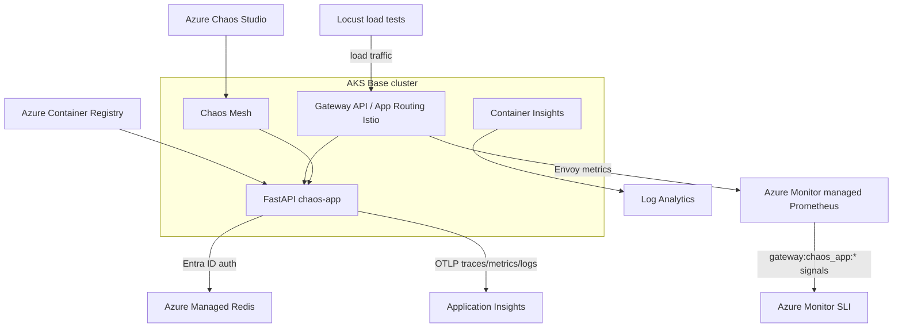

# 壊して学ぼうAKS

AKS Chaos Lab は、Azure Kubernetes Service (AKS) 上で動くアプリケーションを意図的に壊し、自己修復・可観測性・運用上の限界を短いサイクルで学ぶためのラボ環境です。

`azd up` で AKS、サンプルアプリ、Azure Managed Redis、Azure Chaos Studio / Chaos Mesh、Managed Prometheus、Application Insights をまとめて構築します。

## 何を学ぶか

- Kubernetes / AKS の自己修復がどこまで効くかを実環境で確認する
- Redis やネットワークなど外部依存の障害がアプリに与える影響を観察する
- Gateway / Prometheus / Application Insights / Container Insights のシグナルを使って障害を切り分ける
- 回復パターンだけでなく、救えないケースや運用上の制約も理解する

## 全体像


```mermaid
graph TD
  ACR[Azure Container Registry]
  Redis[Azure Managed Redis]
  AppInsights[Application Insights]
  Prom[Azure Monitor managed Prometheus]
  SLI[Azure Monitor SLI]
  LA[Log Analytics]
  CS[Azure Chaos Studio]
  Locust[Locust load tests]

  subgraph AKS[AKS Base cluster]
    GW[Gateway API / App Routing Istio]
    App[FastAPI chaos-app]
    CM[Chaos Mesh]
    CI[Container Insights]
  end

  ACR --> App
  Locust -->|load traffic| GW
  GW --> App
  App -->|Entra ID auth| Redis
  App -->|OTLP traces/metrics/logs| AppInsights
  GW -->|Envoy metrics| Prom
  Prom -->|gateway:chaos_app:* signals| SLI
  CI --> LA
  CS --> CM
  CM --> App
```

| 領域 | 構成 | 詳細 |
|------|------|------|
| アプリ | Python 3.13 + FastAPI + Redis + OpenTelemetry | [`src/app/`](src/app/) |
| インフラ | Bicep subscription scope + `azd` layers (`base`, `sli`) | [`infra/`](infra/), [`azure.yaml`](azure.yaml) |
| Kubernetes | Kustomize, Gateway API, Cilium L7 policy, Chaos Mesh | [`k8s/`](k8s/) |
| 可観測性 | Application Insights, Managed Prometheus, Container Insights, SLI alerts | [docs/observability.md](docs/observability.md) |
| 障害注入 | Azure Chaos Studio から Chaos Mesh 実験を実行 | [docs/chaos-experiments.md](docs/chaos-experiments.md) |

設計判断の理由は README では繰り返しません。判断の背景や却下した選択肢は [ADR 一覧](docs/adr/INDEX.md) を参照してください。

## 前提条件

- Linux (WSL) または macOS
- [Azure Developer CLI (`azd`)](https://learn.microsoft.com/azure/developer/azure-developer-cli/)
- Azure CLI + Bicep extension
- `kubectl`
- Python 3.13+ + [`uv`](https://github.com/astral-sh/uv)
- `azd up` 実行 identity に、サブスクリプション スコープの **Owner**、または **Contributor** + **User Access Administrator**
- Azure Monitor SLI を有効化する場合は、Service Group スコープの追加権限
- 事前登録が必要なプレビュー機能: `AKS-AddonAutoscalingPreview`, `AzureMonitorAppMonitoringPreview`

権限、feature flag 登録、削除時の注意点は [docs/deployment.md](docs/deployment.md) に集約しています。

> このラボは **AKS Base のみ**をサポートします。AKS Automatic をサポートしない理由は [ADR-010](docs/adr/010-aks-automatic-unsupported-due-to-deployment-safeguards.md) を参照してください。

## 最短セットアップ

詳細な手順は [docs/deployment.md](docs/deployment.md) を参照してください。

```bash
azd config set alpha.aks.kustomize on
azd config set alpha.aks.helm on
azd init
azd up
```

ローカル開発と検証:

```bash
cd src
uv sync --group dev
make qa
```

環境削除:

```bash
CONFIRM_DELETE_AZURE_MONITOR_SLI_RESOURCES=true azd down --force --purge
```

## ドキュメントの読み方

| 読みたいこと | 入口 |
|--------------|------|
| 環境構築、権限、feature flag、`azd up/down`、ローカル開発、負荷テスト | [docs/deployment.md](docs/deployment.md) |
| 可観測性のシグナル、SLI、アラート、OTLP logs、運用上の注意 | [docs/observability.md](docs/observability.md) |
| Chaos 実験の種類と実行方法 | [docs/chaos-experiments.md](docs/chaos-experiments.md) |
| なぜその構成にしたか | [docs/adr/INDEX.md](docs/adr/INDEX.md) |
| 継続中のワークアラウンドと解消条件 | [docs/workarounds.md](docs/workarounds.md) |
| AI / コーディングエージェント向けのプロジェクト文脈 | [.github/copilot-instructions.md](.github/copilot-instructions.md) |

## リポジトリ構造

```text
src/app/             FastAPI アプリケーション
src/tests/           unit / integration / load tests
infra/               Bicep subscription-scope infrastructure
infra/sli/           Azure Monitor SLI layer
k8s/apps/chaos-app/  chaos-app Kubernetes manifests
k8s/observability/   Prometheus / Container Insights related manifests
docs/adr/            Architecture Decision Records
docs/features/       セッションをまたぐ Feature Document
.github/agents/      コーディングエージェント定義
```

## ライセンス

MIT
