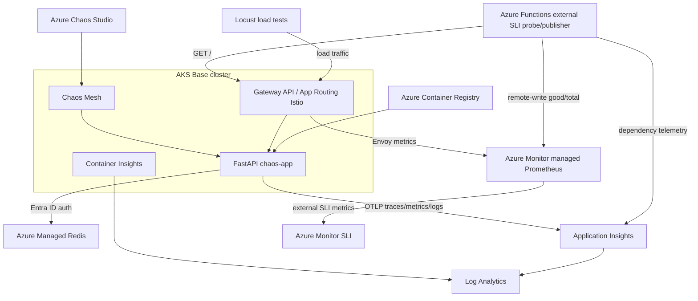

# 壊して学ぼうAKS

AKS Chaos Lab は、Azure Kubernetes Service (AKS) 上で動くアプリケーションを意図的に壊し、自己修復・可観測性・運用上の限界を短いサイクルで学ぶためのラボ環境です。

`azd up` で AKS、サンプルアプリ、Azure Managed Redis、Azure Chaos Studio / Chaos Mesh、Managed Prometheus、Application Insights をまとめて構築します。

## 何を学ぶか

- Kubernetes / AKS の自己修復がどこまで効くかを実環境で確認する
- Redis やネットワークなど外部依存の障害がアプリに与える影響を観察する
- Gateway / Prometheus / Application Insights / Container Insights のシグナルを使って障害を切り分ける
- 回復パターンだけでなく、救えないケースや運用上の制約も理解する

## 全体像


```mermaid
graph TD
  ACR[Azure Container Registry]
  Redis[Azure Managed Redis]
  AppInsights[Application Insights]
  Publisher[Azure Functions external SLI probe/publisher]
  Prom[Azure Monitor managed Prometheus]
  SLI[Azure Monitor SLI]
  LA[Log Analytics]
  CS[Azure Chaos Studio]
  Locust[Locust load tests]

  subgraph AKS[AKS Base cluster]
    GW[Gateway API / App Routing Istio]
    App[FastAPI chaos-app]
    CM[Chaos Mesh]
    CI[Container Insights]
  end

  ACR --> App
  Locust -->|load traffic| GW
  Publisher -->|GET /| GW
  Publisher -->|dependency telemetry| AppInsights
  GW --> App
  App -->|Entra ID auth| Redis
  App -->|OTLP traces/metrics/logs| AppInsights
  AppInsights --> LA
  Publisher -->|remote-write good/total| Prom
  GW -->|Envoy metrics| Prom
  Prom -->|external SLI metrics| SLI
  CI --> LA
  CS --> CM
  CM --> App
```

| 領域 | 構成 | 詳細 |
|------|------|------|
| アプリ | Python 3.14 + FastAPI + Redis + OpenTelemetry | [`src/api/app/`](src/api/app/) |
| インフラ | Bicep subscription scope + `azd` layers (`base`, `sli`) | [`infra/`](infra/), [`azure.yaml`](azure.yaml) |
| Kubernetes | Kustomize, Gateway API, Cilium L7 policy, Chaos Mesh | [`k8s/`](k8s/) |
| 可観測性 | Azure Functions external SLI probe/publisher, Application Insights, Managed Prometheus, Container Insights, SLI alerts | [docs/observability.md](docs/observability.md) |
| 障害注入 | Azure Chaos Studio から Chaos Mesh 実験を実行 | [docs/chaos-experiments.md](docs/chaos-experiments.md) |

設計判断の理由は README では繰り返しません。判断の背景や却下した選択肢は [ADR 一覧](docs/adr/INDEX.md) を参照してください。

## 前提条件

- Windows、macOS、または Linux
- [Azure Developer CLI (`azd`)](https://learn.microsoft.com/azure/developer/azure-developer-cli/)
- Azure CLI + Bicep extension
- `kubectl`
- Python 3.14+ + [`uv`](https://github.com/astral-sh/uv)
- `azd up` 実行 identity に、サブスクリプション スコープの **Owner**、または **Contributor** + **User Access Administrator**
- Azure Monitor SLI を有効化する場合は、Service Group スコープの追加権限
- 事前登録が必要なプレビュー機能: `AKS-AddonAutoscalingPreview`, `AzureMonitorAppMonitoringPreview`

権限、feature flag 登録、削除時の注意点は [docs/deployment.md](docs/deployment.md) に集約しています。

> このラボは **AKS Base のみ**をサポートします。AKS Automatic をサポートしない理由は [ADR-010](docs/adr/010-aks-automatic-unsupported-due-to-deployment-safeguards.md) を参照してください。

## 最短セットアップ

詳細な手順は [docs/deployment.md](docs/deployment.md) を参照してください。

```bash
azd config set alpha.aks.kustomize on
azd config set alpha.aks.helm on
azd init
azd up
```

ローカル開発と検証:

```bash
uv run --no-project "${PWD}/scripts/tasks.py" sync-dev
uv run --no-project "${PWD}/scripts/tasks.py" qa
```

public package registryへ直接接続できず、組織承認済みのPython package indexを使う環境では、task runnerが検証前に依存関係を同期します。

```bash
uv run --no-project "${PWD}/scripts/tasks.py" qa
```

環境削除:

```bash
azd down --force --purge
```

## ドキュメントの読み方

| 読みたいこと | 入口 |
|--------------|------|
| 環境構築、権限、feature flag、`azd up/down`、ローカル開発、負荷テスト | [docs/deployment.md](docs/deployment.md) |
| 可観測性のシグナル、SLI、アラート、OTLP logs、運用上の注意 | [docs/observability.md](docs/observability.md) |
| Chaos 実験の種類と実行方法 | [docs/chaos-experiments.md](docs/chaos-experiments.md) |
| 依存パッケージとツールの更新責務、検査結果の解釈 | [docs/dependency-management.md](docs/dependency-management.md) |
| なぜその構成にしたか | [docs/adr/INDEX.md](docs/adr/INDEX.md) |
| 継続中のワークアラウンドと解消条件 | [docs/workarounds.md](docs/workarounds.md) |
| AI / コーディングエージェント向けのプロジェクト文脈 | [.github/copilot-instructions.md](.github/copilot-instructions.md) |

## リポジトリ保守

日常の点検には`review-repo`エージェントのfastモードを使います。fastモードは`scripts/tasks.py`の`review-repo-fast` task targetを唯一の上位実行入口として呼び、内容指紋taskとオフラインで完結する検査だけを実行します。文書とAI運用資産の意味評価や専門skillは実行しません。全検査ではfullモードを指定します。fullモードは`review-repo-full` task targetの全検査に加えて、構造化inventoryを使った公開MarkdownリンクとBicep APIのcheck-only確認、文書とAI運用資産の意味評価を実行します。scheduled workflowが担当するversion候補、EOL、support範囲、互換性は再評価しません。完全な呼び出し、出力、副作用、検査の包含関係は[review-repoエージェント](.github/agents/review-repo.agent.md)を参照してください。

通常のversion更新候補は[Renovate](.github/renovate.json)が検出し、Renovateが扱えないgh-aw、Lefthook、Renovate app自体の稼働は週次の[Repository freshness check](.github/workflows/repository-freshness-check.md)が検出します。責務の境界、機械検査の対象、fast / fullレビューとの関係は[依存パッケージとツールの更新管理](docs/dependency-management.md)を参照してください。

## リポジトリ構造

```text
pyproject.toml       uv workspace ルート設定 (ruff/ty 共通設定、開発用依存)
uv.lock              workspace 全体のロックファイル
src/api/             FastAPI アプリケーション、Dockerfile、unit / integration / load tests
src/external-sli-publisher/  Azure Functions external SLI publisher
infra/               Bicep subscription-scope infrastructure
infra/modules/functions/     Azure Functions hosting modules
infra/modules/azmonitor/     Application Insights / Log Analytics / SLI modules
infra/modules/prometheus/    Managed Prometheus pipeline / rules / alerts
infra/sli/           Azure Monitor SLI layer
k8s/apps/chaos-app/  chaos-app Kubernetes manifests
k8s/observability/   Prometheus / Container Insights related manifests
docs/adr/            Architecture Decision Records
docs/features/       セッションをまたぐ Feature Document
.github/agents/      コーディングエージェント定義
.github/hooks/       Copilot CLI postToolUse 用 lint/format フィードバック
```

> Python は uv workspace 構成です。ルートで同期すれば、`src/api` と `src/external-sli-publisher` の両方の依存と開発ツール (ruff / ty / pytest) が揃います。通常の同期は [ADR-013](docs/adr/013-uv-workspace-unified-tooling.md)、組織承認済み package index を使う環境は [ADR-017](docs/adr/017-approved-index-conversion-for-managed-environments.md) を参照してください。

## ライセンス

MIT
