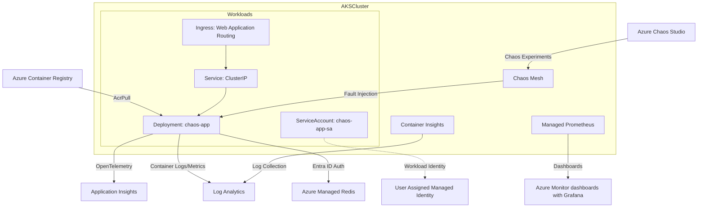
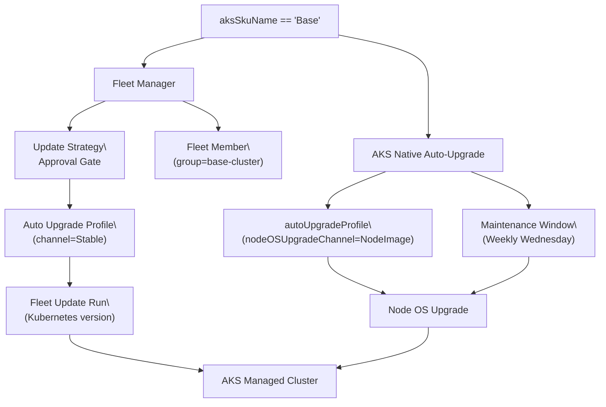
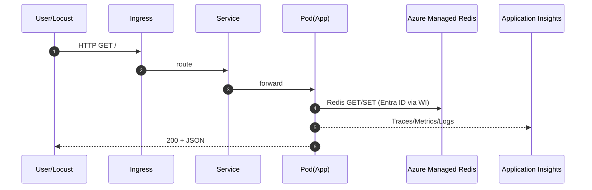
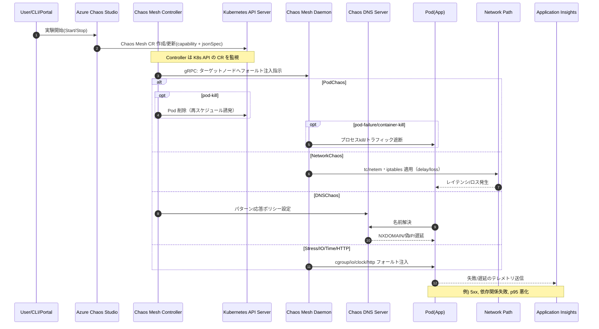
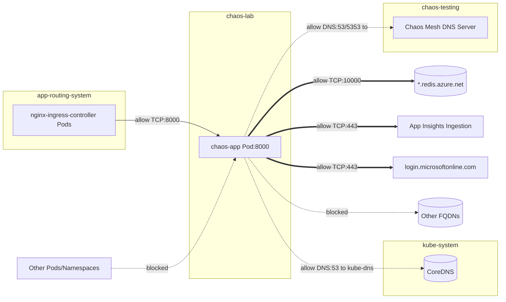

# 設計 - AKS Chaos Lab

## アーキテクチャ（概略）


## AKS 更新管理 (Base モード)
- Base モード選択時（`aksSkuName=Base`）は、Kubernetesバージョンの自動アップグレードとNode OSイメージの自動アップグレードを分離して管理する。
- **Kubernetesバージョンの更新**: Azure Kubernetes Fleet Manager を使用
  - `infra/modules/fleet.bicep` で Fleet をデプロイ
  - AKS クラスタを Fleet メンバー（`group=base-cluster`）として登録
  - 更新戦略の `beforeGates` に `type: Approval` のゲートを定義し、手動承認が完了するまで Update Run を開始しない
  - autoUpgradeProfile（`channel=Stable`、`nodeImageSelection.type=Consistent`）を作成
  - Azure Monitor の Scheduled Query Rule (`fleet-approval-pending`) を追加し、ARG から Approval Gate の Pending 状態を検出してアクション グループへ通知
- **Node OSイメージの更新**: AKSネイティブの自動アップグレード機能を使用
  - `infra/modules/aks.bicep` で `autoUpgradeProfile.nodeOSUpgradeChannel=NodeImage` を設定
  - メンテナンスウィンドウ（`aksManagedNodeOSUpgradeSchedule`）を設定（毎週水曜日 00:00 JST、4時間）
  - Azure Monitor の Scheduled Query Rule (`aks-nodeos-autoupgrade`) を追加し、ARG からNode OSアップグレードイベントを検出してアクション グループへ通知



## データフロー

### アプリケーション リクエスト


### カオス実験（制御と効果伝播）


## コンポーネント
- アプリケーション: FastAPI (Python), Redisクライアント, OpenTelemetry
- Kubernetes: Deployment, Service, Ingress, ConfigMap, Secret, HPA, PodDisruptionBudget
- セキュリティ: Azure AD Workload Identity, MSI for ACR Pull
- 可観測性: OpenTelemetry Collector（オプション）/直接AI
- 障害注入: Azure Chaos Studio + Chaos Mesh capabilities による AKS 向け実験（Pod/Network/Stress/IO/Time/HTTP/DNS の 7 種類）
  - Chaos Mesh: azd の Helm 統合で自動導入・管理（namespace: chaos-testing）

### Chaos Studio 実験（Bicep設計）
- モジュール: `infra/modules/chaos/experiments.bicep`
  - 入力: `aksId`, `namespace`（既定: `chaos-lab`）、`appLabel`（既定: `chaos-app`）、`defaultDuration`（既定: `PT5M`、Azure側のフォールバック）、`meshDuration`（既定: `300s`、Chaos Mesh jsonSpec用）
  - アイデンティティ: `SystemAssigned`
  - セレクタ: AKS クラスタIDを `targets` に指定
  - ステップ: 単一ステップ・単一ブランチに1アクション（各キャパビリティ）
- 対応キャパビリティ（URN）
  - PodChaos: `urn:csci:microsoft:azureKubernetesServiceChaosMesh:podChaos/2.2`
  - NetworkChaos: `urn:csci:microsoft:azureKubernetesServiceChaosMesh:networkChaos/2.2`
  - StressChaos: `urn:csci:microsoft:azureKubernetesServiceChaosMesh:stressChaos/2.2`
  - IOChaos: `urn:csci:microsoft:azureKubernetesServiceChaosMesh:ioChaos/2.2`
  - TimeChaos: `urn:csci:microsoft:azureKubernetesServiceChaosMesh:timeChaos/2.2`
  - HTTPChaos: `urn:csci:microsoft:azureKubernetesServiceChaosMesh:httpChaos/2.2`
  - DNSChaos: `urn:csci:microsoft:azureKubernetesServiceChaosMesh:dnsChaos/2.2`
  - KernelChaos: `urn:csci:microsoft:azureKubernetesServiceChaosMesh:kernelChaos/2.2`（既定無効）
- JSON Spec（例: PodChaos）
```json
{
  "action": "pod-failure",
  "mode": "one",
  "duration": "300s",
  "selector": {
    "namespaces": ["chaos-lab"],
    "labelSelectors": {"app": "chaos-app"}
  }
}
```

#### NetworkChaos バリエーション設計（遅延/停止）
- 目的: ネットワーク遅延（ユーザ体感劣化）と完全停止（依存不可）を個別に検証可能にする。
- 実装方針（Bicep）:
  - 既存の `exp-aks-network-delay`（遅延: delay 200±50ms）を維持。
  - 新規で `exp-aks-network-loss` を追加し、`loss=100%` の停止（ブラックホール）を注入。
  - トグル: `enableNetworkChaos`（遅延）と別に `enableNetworkChaosLoss`（停止）を追加。
  - 期間管理の方針: Chaos Mesh 側の `jsonSpec.duration` を主とし（既定: `300s`）、Azure アクションの `duration` はフォールバックとして設定する（実装の優先順位に一致）。
  - `jsonSpec`（例: 停止）
```json
{
  "action": "loss",
  "mode": "all",
  "duration": "300s",
  "selector": {"namespaces": ["chaos-lab"], "labelSelectors": {"app": "chaos-app"}},
  "direction": "to",
  "loss": {
    "loss": "100",
    "correlation": "0"
  }
}
```
- 受入基準（要件と整合）:
  - `/` は503でフェイルファストし、プロセスは健全を維持。
  - `/health` は Redis 有効時 503 を返却（ハング無し）。
  - 終了後 p95/5xx を通常水準へ回復。
  - テレメトリ（Application Insights/Prometheus/K8s Events）で失敗が観測可能。

## AKS固有の設計

### ネットワーキング
- **Azure CNI Overlay + Cilium**: 高性能データプレーンと豊富なネットワーク機能
- **Advanced Container Networking**: L7ネットワークポリシーとネットワーク可観測性を有効化
- **Private Endpoint**: Azure Managed Redisおよび Azure Container Registry へのセキュアなプライベート接続
- **ACR プライベートアクセス**: `privatelink.azurecr.io` Private DNS ゾーンを作成し、VNet にリンク。`registry` サブリソースで Private Endpoint を作成。
- **ACR パブリックアクセス**: 利便性のため PublicNetworkAccess を Enabled に設定（Push/Pull 可）。
- **Web Application Routing**: AKSアドオンによるnginx ingress controller（静的IP設定、Prometheusメトリクス対応）
- **NetworkPolicy (Ingress 制限)**: `chaos-app` Pod は Ingress Controller からの受信のみ許可（L3/L4）
- **Network Security Group**: `snet-aks` に NSG を関連付け、受信 TCP 80/443 を許可（source: `*`）
- **Availability Zones**: ノードプールをゾーン 1/2/3 に分散（対象リージョンで有効）
- **可観測性 (Prometheus/Container Insights)**: Azure Monitor managed Prometheus を有効化（`azureMonitorProfile.metrics.enabled=true`）。Container Insights を有効化（`addonProfiles.omsagent`）。
 - **Azure Monitor Workspace (AMW)**: Managed Prometheus のメトリクス保管先として AMW を明示作成（`Microsoft.Monitor/accounts`）。
 - **DCR/DCE/DCRA**: Managed Prometheus の収集パイプラインを Data Collection Rule/Endpoint/Association で明示構成（AKS クラスタとAMWを接続）。
 - **Recording Rules**: Linux/UX 向けの推奨レコーディングルール群を `prometheusRuleGroups` でIaC管理（トグルで有効化）。
 - **Cost Analysis**: AKS コスト分析アドオンを有効化し、クラスタ内のコスト可視化を提供（`addonProfiles.costAnalysis`）。

### セキュリティ・認証  
- **Azure AD/Entra ID統合とローカルアカウント無効化**: 
  - `aadProfile.managed: true` および `aadProfile.enableAzureRbac: true` によりAzure RBACでKubernetes認可を実現
  - `disableLocalAccounts: true` によりローカルアカウント（kubectl証明書ベース認証）を無効化し、Entra IDのみの認証を強制
  - アイデンティティガバナンス、条件付きアクセスポリシー、監査性の向上
  - **注意**: AKS Automatic モードは現在一時的に無効化されています
- **Workload Identity**: Federated Identity Credential + ServiceAccount による最新OIDC認証方式
  - User Assigned Managed Identity (UAMI) によるAKSとの統合
  - ServiceAccount に `azure.workload.identity/client-id` アノテーションでClient ID注入
  - Pod に `azure.workload.identity/use: "true"` ラベル設定
  - 環境変数（AZURE_CLIENT_ID, AZURE_TENANT_ID, AZURE_FEDERATED_TOKEN_FILE）の自動注入
- **Entra ID認証**: Azure Managed RedisへのパスワードレスアクセスをUser Assigned Managed Identity経由で実現
- **Private Network**: VNet統合によりインターネット経由のトラフィックを最小化

### 可観測性・監視
- **Container Insights**: Log AnalyticsへのPod/コンテナログ・メトリクスの自動収集
- **OpenTelemetry統合**: Application Insightsへのトレース・メトリクス・ログ送信
  - APPLICATIONINSIGHTS_CONNECTION_STRING環境変数による接続設定
  - azure-monitor-opentelemetryライブラリによる自動計装
  - HTTP要求、依存関係（Redis）、例外、カスタムメトリクスの自動収集
- **Advanced Network監視**: L3/L4/L7レベルのネットワークフロー監視

## NetworkPolicy 設計（chaos-app）

- 目的: `chaos-app` Pod の受信を Ingress Controller に限定
- 適用範囲: Namespace `chaos-lab`、`podSelector: app=chaos-app`
- 許可元:
  - `namespaceSelector: kubernetes.io/metadata.name=app-routing-system` AND `podSelector: app.kubernetes.io/component In [ingress-controller]`
  - 将来運用に備え、`namespaceSelector: kubernetes.io/metadata.name=chaos-lab` AND 同 `podSelector`
- ポート: TCP/8000（Podのコンテナポート）
- 注意点: CNI 実装によっては kubelet の Readiness/Liveness Probe が影響を受ける場合あり。問題発生時は例外ルールを追加検討。

### 送信（Egress）制御（Cilium）
- 目的: `chaos-app` Pod からの外向き通信を Azure Managed Redis のみ許可
- 実装: CiliumNetworkPolicy により `*.redis.azure.net` と `*.*.redis.azure.net` への FQDN ベース許可（TCP/10000）。DNS 解決は `kube-system/kube-dns` への 53/TCP,UDP のみ許可。
- 適用ファイル: `k8s/base/ciliumnetworkpolicy-egress-allowlist.yaml`
  - 併せて Application Insights 送信を許可（`*.in.applicationinsights.azure.com`, `*.livediagnostics.monitor.azure.com`, `dc.services.visualstudio.com`, `live.applicationinsights.azure.com` の 443/TCP）。DNS クエリも同FQDNのみ許可。
  - 認証プロバイダ（Entra ID/MSAL）向けに `login.microsoftonline.com` の 443/TCP も許可（DNS含む）。

**重要: DNS Chaosとの連携設定**
DNS Chaosを正常に動作させるため、CiliumNetworkPolicyには以下の特別な設定が含まれています：
- Chaos DNS Server（`chaos-mesh-dns-server`）への通信を完全に許可（L7 DNSフィルタリングを意図的に回避）
- Service Port（53）とTarget Port（5353）の両方に対応したルール設定
- `chaos-testing`ネームスペースのChaos DNS Serverコンポーネントへの直接アクセス許可

この設定により、DNS ChaosがCiliumNetworkPolicyによってブロックされることなく、タイムアウトではなく即座のエラー応答を実現できます。




### Azure Chaos Studio と Chaos Mesh の Duration Control

重要な制約として、Azure Chaos Studio の実験設定で`duration`（例：PT5M）を指定しても、Chaos Mesh の`jsonSpec`内に`duration`フィールドが含まれていない場合、Chaos Mesh のデフォルト継続時間（通常2-3分）が優先されます。

> **Microsoft 公式ドキュメント**: "Specifying duration within the `jsonSpec` isn't necessary, but it's used if available."

この問題を解決するため、すべての continuous 型 Chaos Mesh 実験の`jsonSpec`には明示的に`duration`フィールドを含める必要があります：

```json
{
  "action": "error",
  "mode": "all", 
  "duration": "300s",  // ← 必須：Chaos Mesh形式で秒単位指定
  "patterns": ["*.redis.azure.net"],
  "selector": {"namespaces": ["chaos-lab"]}
}
```

実装の重要ポイント：
- `jsonSpec.duration` が優先され、Azure の `action.duration` はフォールバック
- discrete 型実験（KernelChaos）では duration 不要
- continuous 型実験では必ず `meshDuration` パラメータ（既定: 300s）を jsonSpec に含める

## アプリAPIの振る舞い（要点）
- `GET /`：Redis 利用（有効時）。障害時は 503 と標準化エラー JSON を返却。
- `GET /health`：Redis 無効時は常に 200。Redis 有効時は `PING` 計測に基づき 200/503 を返す（5秒TTLのヘルスキャッシュあり）。
- エラーハンドラ：未捕捉例外は 500 と標準化エラー JSON。`LOG_LEVEL=DEBUG` の場合のみ `detail` を含む。
- `X-Request-ID`：ミドルウェアで生成・伝播し、レスポンスヘッダとトレース属性（`http.request_id`）に反映。

## インターフェース（API/操作）
- アプリAPI: `/`, `/health`（/chaos系は提供しない）
- 運用操作: kubectl, az AKS, Chaos Studio CLI/API

## データモデル
- 設定: 環境変数（ConfigMap/Secret由来）
- テレメトリ: TraceID、ChaosExperimentID、カスタムメトリクス

## エラーマトリクス（抜粋）
- Redis接続エラー: 429/500返却、ログ/トレースに例外、バックオフ
- ハング: Livenessで再起動、再起動イベントとテレメトリで可視化
- ネットワーク遮断: タイムアウト -> エラーレスポンス -> 再試行

### エラーマトリクス（詳細）
| 事象 | 検出/条件 | 応答コード | レスポンス | テレメトリ | 備考 |
|---|---|---|---|---|---|
| Redis操作失敗 | `get/set/incr` 例外 | 503 | 標準化エラー(JSON) | 例外をspanに記録 | ルート`/`のみ 503 |
| 未捕捉例外 | FastAPIハンドラ外例外 | 500 | 標準化エラー(JSON) | 例外/スタックをspan | `LOG_LEVEL=DEBUG`時のみdetail表示 |
| ヘルス: Redis無効/未設定 | `REDIS_ENABLED=false` or host未設定 | 200 | `status=healthy` | なし | 5秒キャッシュ |
| ヘルス: Redis疎通不可 | `ping`失敗 | 503 | `status=unhealthy` | 失敗メトリクス | 5秒キャッシュ |

## テスト戦略
- ユニット: FastAPIエンドポイント、Redisラッパ、テレメトリ
- 統合: AKS上のE2E（Ingress->Service->Pod）、Chaos実験含む
  - 負荷: Locustシナリオ（smoke/baseline/stress/spike）

### 単体テスト戦略（詳細）
- ルート`/`: 正常200、Redis例外時503（標準化エラー）の検証
- `/health`: Redis無効時200、疎通不可で503の検証（キャッシュ分岐含む）
- 例外ハンドラ: 未捕捉例外で500+span記録、`LOG_LEVEL=DEBUG`でdetail出力
- RedisClient: `AuthenticationError`でのトークン再取得・1回再試行
- テレメトリ: 設定に応じた有効/無効の分岐（接続文字列未設定時は無効化ログ）

## Chaos Studio AKS 故障カタログの網羅（現状）
以下のAKS向けサービスダイレクト故障のうち、KernelChaos を除く 7 種類を実装済み（要: Chaos Mesh デプロイ）。

| 種別 | Capability | URN | 概要 | 主なパラメータ |
|---|---|---|---|---|
| Pod | PodChaos-2.2 | urn:csci:microsoft:azureKubernetesServiceChaosMesh:podChaos/2.2 | Pod/Containerの失敗・再起動 | jsonSpec (Chaos Mesh PodChaos spec 部分: action, mode, selector など) |
| Network | NetworkChaos-2.2 | urn:csci:microsoft:azureKubernetesServiceChaosMesh:networkChaos/2.2 | 遅延/パケットロス/切断/重複等 | jsonSpec (NetworkChaos: delay, loss, throughput, selector 等) |
| Stress | StressChaos-2.2 | urn:csci:microsoft:azureKubernetesServiceChaosMesh:stressChaos/2.2 | CPU/Memory等のストレス付与 | jsonSpec (StressChaos: stressors, selector 等) |
| I/O | IOChaos-2.2 | urn:csci:microsoft:azureKubernetesServiceChaosMesh:IOChaos/2.2 | I/Oの遅延/障害 | jsonSpec (IOChaos: action, delay, errno 等) |
| DNS | DNSChaos-2.2 | urn:csci:microsoft:azureKubernetesServiceChaosMesh:dnsChaos/2.2 | DNS解決の失敗や誤応答を再現 | jsonSpec (DNSChaos: patterns, records, selector 等) |
| HTTP | HTTPChaos-2.2 | urn:csci:microsoft:azureKubernetesServiceChaosMesh:httpChaos/2.2 | HTTP要求/応答の遅延・改変・エラーを再現 | jsonSpec (HTTPChaos: target, patch, delay/fault 等) |
| Kernel | KernelChaos-2.2 | urn:csci:microsoft:azureKubernetesServiceChaosMesh:kernelChaos/2.2 | Linuxカーネルレベルの障害（syscall失敗など） | jsonSpec (KernelChaos: failKernRequest, selector 等) |
| Time | TimeChaos-2.2 | urn:csci:microsoft:azureKubernetesServiceChaosMesh:timeChaos/2.2 | システムクロックのずれ・時間改変 | jsonSpec (TimeChaos: timeOffset, clockIds, selector 等) |

**注記: DNS Chaosの観測可能性について**
DNS Chaosは正常に動作し、`SERVFAIL`（Response Code: 2）エラーを返すことが確認されていますが、HubbleメトリクスでDNSエラー応答が正しく記録されない場合があります。これは以下の理由によるものと推定されます：
- CiliumのDNS Proxyが介在し、元のエラー応答が処理される際に正常応答として扱われる可能性
- DNS Chaosのエラー応答が非常に高速（0.070秒）で、Hubbleの30秒間隔メトリクス収集との同期問題
- Chaos Meshの独自実装がHubbleの解析に適合していない可能性

この現象はDNS Chaosの核心機能には影響せず、アプリケーションレベルでのDNSエラーハンドリングテストは正常に実行できます。DNS Chaosの効果検証には、アプリケーションログやAPMツールでのエラーハンドリング監視を推奨します。

**重要: Azure Chaos Studioの実験タイプ設計**
実験は性質に応じて`discrete`（一回実行）と`continuous`（継続実行）に分類されます：

**discrete実験（一回実行）**:
- **KernelChaos**: システムコール失敗の注入は一度実行すれば十分（jsonSpec に duration 不要）

**continuous実験（継続実行）**:
- **PodChaos**: Pod failure は継続的な影響が必要（コンテナイメージを pause に変更）
- **NetworkChaos**: ネットワーク遅延・パケットロスは継続的な影響が必要
- **StressChaos**: CPU・メモリ負荷は継続的な負荷が目的
- **IOChaos**: I/O遅延は継続的な影響が必要
- **DNSChaos**: DNS解決失敗は継続的な影響が必要
- **HTTPChaos**: HTTP要求妨害は継続的な影響が必要
- **TimeChaos**: 時間ずれは継続的な影響が必要

注意: Chaos Mesh の既知不具合により KernelChaos は一時的に除外しています。詳細: https://github.com/chaos-mesh/chaos-mesh/issues/4059

前提条件:
- AKS クラスター（Linuxノードプール）
- Chaos Mesh は azd の AKS/Helm 統合で自動インストール（`services.chaos-mesh` に `k8s.namespace: chaos-testing` を指定し、`k8s.helm` で repo/chart/version/values を定義）
- 認証: Kubernetesローカルアカウントまたは AKS-Managed Microsoft Entra 認証に対応（v2.2）
- azd Helm/Kustomize は alpha 機能のため、実行前に以下を設定
  - `azd config set alpha.aks.kustomize on`
  - `azd config set alpha.aks.helm on`

設計方針:
 
- 名前空間/ラベルで影響範囲を制御（selector.namespaces, selector.labelSelectors）
- 検証指標: App Insightsの依存関係失敗率、レスポンスタイム、5xx、コンテナ再起動回数、K8s Events


## Chaos Mesh 導入計画（azd/Helm）
- 目的: Azure Chaos Studio の AKS向け capabilities（Chaos Mesh）を有効化し、Pod/Network/Stress 等の実験を可能にする
- リリース構成（案）:
  - Helm repo: `https://charts.chaos-mesh.org`
  - Chart: `chaos-mesh`
  - Version: `2.7.3`（AKS 1.33 での互換を前提に検証。必要に応じ更新）
  - Release name: `chaos-mesh`
  - Namespace: `chaos-testing`（`k8s/chaos/namespace.yaml` を先に適用）
  - Values: `infra/helm/chaos-mesh-values.yaml`
- azd への組み込み（方針）:
  - `azure.yaml` の `services` に `chaos-mesh` を追加し、`k8s.helm` で上記リリースを宣言
  - `hooks.predeploy` に `kubectl apply -f k8s/chaos/namespace.yaml` を追加（存在しない場合のみ適用）
- 運用/削除:
  - `azd down` で Helm リリースを削除
  - 名前空間は必要に応じて `kubectl delete ns chaos-testing --ignore-not-found`
- 検証:
  - `kubectl get pods -n chaos-testing` でコンポーネント起動
  - Chaos Studio 実験の作成/適用で Pod/Network などのFaultが実行可能であること
## 命名規約の適用（要約）

- Azure: 「リソース種類を接頭辞」にし、CAF略称+`appName-environment` を採用。
  - 例: 実験は `exp-aks-<capability>`（語尾`-chaos`禁止）、DCR/DCE/DCRAは `dcr-`/`dce-`/`dcra-` 接頭辞。
- Kubernetes: 互換のため `app: chaos-app` 維持＋推奨ラベル `app.kubernetes.io/*` を各リソースへ付与。
- メトリクス/アラート: ルールグループ名は `app-slo-recording-rules-group-<aksName>` / `app-slo-alerts-<aksName>`。
  - 変数化: アラート対象の Ingress 名/Namespace は `appSloIngressName` / `appSloIngressNamespace`（既定: `chaos-app` / `chaos-lab`）

## SLO計測（Web Application Routing × Prometheus）【推奨構成】
**目的:** Web Application Routing の nginx メトリクスからp95遅延とエラー率を可観測化し、PrometheusでSLOを監視。

### 収集設定
- **Managed Prometheus + AMA**: DCRにより `nginx_ingress_controller_*` 系メトリクスをスクレイプ
- **AMA設定**: `k8s/observability/ama-metrics-settings-configmap.yaml` で podannotations=true を有効化
  - Pod注釈に基づく自動スクレイピング（`prometheus.io/scrape=true`、`prometheus.io/port=10254`）
  - `app-routing-system` 名前空間内のコントローラPodを対象とする
  - ホスト名ラベルによるメトリクス分離が可能

### レコーディングルール（推奨）
- **ファイル**: `infra/modules/prometheus/recording-rules.bicep`
- **対象メトリクス**: `nginx_ingress_controller_request_duration_seconds` ヒストグラム、`nginx_ingress_controller_requests`
- **フィルタ条件**: なし（単一コントローラ運用を前提としたクラスタ全体集計）
- **レコーディングルール**:
  - `app:nginx_ingress_request:p95`: histogram_quantile(0.95, ...)によるP95遅延
  - `app:nginx_ingress_error_rate:ratio`: status≥400（4xx+5xx）のリクエスト比率

### アラートルール（推奨）
- **ファイル**: `infra/modules/prometheus/alert-rules.bicep`
- **閾値**: P95遅延>1秒、エラー率>1%
- **評価期間**: 5分間の継続的な閾値超過で発火
- **対象**: 上記レコーディングルールの結果を参照

### 運用考慮事項
- 閾値（P95遅延、エラー率）は環境やSLA要件に応じて調整可能
- メトリクス収集の有効性確認: `kubectl exec -n app-routing-system <nginx-pod> -- curl -s localhost:10254/metrics`
