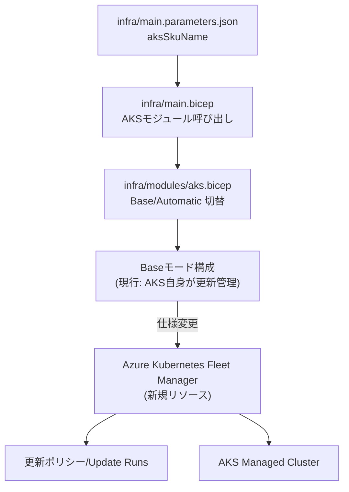
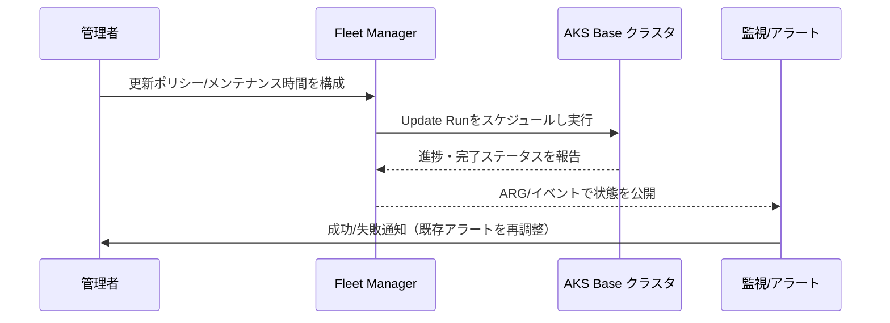

### 分析 - AKS Baseモードの更新管理をFleet Managerへ委譲 - 2025-09-19T00:00:00Z
**目的**: `aksSkuName=Base` 選択時に Azure Kubernetes Fleet Manager が AKS クラスタ更新を管理する仕様追加の影響範囲と要件を整理する。
**コンテキスト**: 現状テンプレートは Base/Automatic の2モードをサポートし、Baseモードでは `infra/modules/aks.bicep` がクラスター自身の自動アップグレード設定を直接定義している。Fleet Manager リソースは未導入。
**決定**: 仕様追加の是非は未決定。必要な情報を整理し、次フェーズで設計方針を選定する。
**実行**:
- 既存ドキュメント (`docs/requirements.md`, `docs/deployment.md`, `README.md`) とインフラ定義 (`infra/main.bicep`, `infra/modules/aks.bicep`, `infra/main.parameters.json`) を確認。
- `aksSkuName` パラメータの利用箇所と Base/Automatic 切り替えロジックを分析。
- Fleet Manager 連携が未実装であることを確認。
**出力**:
- **関連ファイルインベントリ**
  - `infra/main.parameters.json`: 既定値 `Base` の `aksSkuName`
  - `infra/main.bicep`: AKS モジュール呼び出し時に `skuName` として連携
  - `infra/modules/aks.bicep`: Base モードと Automatic モードの構成差分（自動アップグレード/メンテナンスウィンドウ/アラート定義など）
  - `docs/deployment.md`, `README.md`: モード説明のみ、Fleet Manager 言及なし
  - `docs/requirements.md`: Base/Automatic いずれの更新管理要件も未定義
- **新規EARS要件（ドラフト）**
  - 状態駆動: `システムは aksSkuName が Base の間、Azure Kubernetes Fleet Manager が AKS クラスタの制御プレーンおよびノードOS更新を制御するものとする。`
  - 望ましくない動作: `Fleet Manager の更新が失敗した場合、システムは 失敗イベントを記録し、再試行または手動介入手順を提示するものとする。`
- **依存関係と制約**
  - Fleet Manager の導入には `Microsoft.ContainerService/fleets` リソース作成、クラスター登録、更新ポリシー定義、Update Run トリガが必要。
  - Base モード特有の自動アップグレード/メンテナンス設定（既存）との重複や競合を解消する必要がある。
  - 既存のアラート（ARGベースの自動アップグレード検知）は Fleet Manager 経由に合わせた見直しが必要。
- **Mermaid依存関係グラフ**

- **Mermaidシーケンス（更新フロー）**

- **エッジケースと障害シナリオ**
  - Fleet Manager リソース未作成やクラスタ未登録時に Base モードが選択された場合の扱い
  - Base→Automatic へ変更した際の Fleet 登録解除手順
  - Update Run 失敗時のロールバックと再実行方針
  - マルチクラスター対応（将来的に Fleet で複数クラスタを扱う場合）の制約
  - 既存の手動 `az aks upgrade` 運用との整合性
- **信頼度スコア**: 0.72
  - 根拠: AKS Base/Automatic の既存構成は把握済みだが、Fleet Manager 連携はリポジトリ未導入で追加作業範囲が広い。Azure Fleet の最新API仕様確認が必要な点が不確実要素。
**検証**: 本フェーズでは実装なし。情報整理のみ実施。
**次**: 設計フェーズで Fleet 連携方式（既存設定の置き換え/併存）、必要なBicepモジュール追加、ドキュメント更新範囲を確定する。
