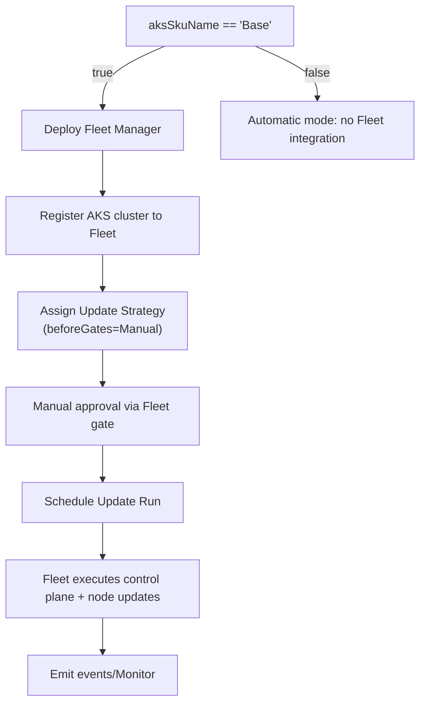

### 設計 - AKS Baseモードの更新管理をFleet Managerへ委譲 - 2025-09-19T00:00:00Z
**目的**: `aksSkuName=Base` 選択時に Azure Kubernetes Fleet Manager が更新を管理し、更新前に手動承認を必須とする仕様を実現するための設計とドキュメント更新方針を定義する。
**コンテキスト**: 分析フェーズで Fleet 未導入と既存の自動アップグレード設定との競合が確認された。追加要件として、Fleet Update Strategy の `beforeGates` （API: `2025-04-01-preview`）を用いた手動承認が提示された。信頼度スコア 0.72 → 0.80。
**決定**:
1. Baseモード選択時に Fleet Manager リソースをデプロイし、AKS クラスタを登録する。
2. Baseモードの既存自動アップグレード/メンテナンス構成をFleet管理へ移行する（AKSクラスタ側の自動アップグレード設定は停止）。
3. Fleet Update Strategy で `beforeGates` に `Manual` 承認ステップを定義し、アップデート開始前に手動承認を要求する。
4. ドキュメント（`docs/requirements.md`, `docs/design.md`, `docs/deployment.md`, `README.md`）にFleet管理手順と承認ワークフローを反映する。
5. 自動アップグレード検知アラートはFleetイベント監視に合わせて修正（仕様上の記述を変更）。
**実行**:
- Bicepモジュール追加方針の策定
- EARS要件の更新案決定（手動承認を明記）
- ドキュメント更新箇所洗い出し
**詳細設計**:
- **インフラ構成変更**
  - `infra/modules/fleet.bicep`（新規）を作成。Fleetリソース、Update Strategy（`beforeGates`→Manual）、更新スケジュール、Update Runを定義。
  - `infra/main.bicep` で `aksSkuName == 'Base'` の場合に Fleet モジュールを呼び出し。
  - `infra/modules/aks.bicep` Baseモード設定から以下を削除し Fleet 管理へ移行:
    - `autoUpgradeProfile`, `maintenanceConfigurations`, `scheduledQueryRules`（自動アップグレード検知アラート）。
  - Fleet用のアラート（Update Run失敗検知など）を追加検討（今回は仕様追加のみ、実装は別タスク候補）。
- **承認フロー詳細**
  - Update Strategy: `approvals: { beforeGates: [{ gateName: 'manual-approval', type: 'Manual' }] }`
  - 現行APIでは承認者指定・タイムアウトの高度設定は不可。手動承認は Fleet Portal / CLI の `az fleet update strategy gate` コマンドで実施する運用とし、README に手順を記載。
- **フロー設計**

- **更新方針**
  - `docs/requirements.md`: Baseモードの更新管理がFleetによる手動承認付きで実施される要件を追加。
  - `docs/design.md`: Fleetリソース構成、承認ゲートフロー、エッジケース処理を追記。
  - `docs/deployment.md`/`README.md`: Baseモード利用時のFleet前提、承認手順、更新結果確認方法を追記。
  - 将来的なマルチクラスタへの拡張性について設計ノートを記載。
- **テスト戦略**
  - Bicepテンプレートのバリデーション（`az deployment sub what-if`）
  - Fleetリソース作成のユニットテスト（可能ならBicepモジュールテスト）
  - Update Strategy Gate の承認フロー確認（手動で `az fleet update strategy gate update` を実施）
  - 実運用でのUpdate Runログ確認手順をドキュメント化
- **依存関係**:
  - Fleetリソース作成には `Microsoft.ContainerService/fleets` プロバイダー登録が必要。
  - AKSクラスタ登録には Fleet 対象リージョン対応と権限（Contributor以上）が必要。
- **リスク/緩和**:
  - AKS自身の自動アップグレード設定とFleetが競合 → BaseモードではAKS側設定を無効化しFleetに一本化。
  - 手動承認忘れによる更新滞留 → READMEで更新スケジュール前の承認ガイドラインを明記。
  - Fleet稼働に伴う追加コスト・権限 → READMEで注意喚起。
  - Update Run失敗時の通知 → 現時点では詳細要件を保持せず、将来的にActivity Log等を確認したうえで追加アラートを検討。
**信頼度更新**: 0.80（承認機能の公式ドキュメントを参照し要件を反映済み）。
**検証**: 設計レビュー未実施（次フェーズで実装と併せて検証）。
**次**: 実装フェーズでBicepモジュール追加/既存設定調整、ドキュメント更新を行う。
