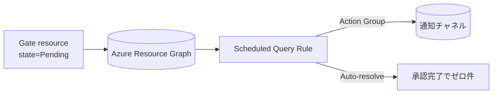

### 設計 - Fleet Manual Gate 承認待ちアラート - 2025-09-19T00:00:00Z
**目的**: Base モードで Fleet Manager の Manual Gate が Pending になった際に Azure Monitor アラートを発火させる仕組みを設計する。
**コンテキスト**: 分析フェーズで ARG から Gate 状態を取得できることを確認。既存の Scheduled Query Rule 構成を Fleet 用に再利用する。
**決定**:
1. `infra/modules/fleet.bicep` に Scheduled Query Rule (Log Alert) を追加し、Gate Pending を検知する。
2. KQL クエリはテンプレート (`infra/modules/fleet/templates/pending-approval-gate.kql`) とし、Fleet リソース ID を文字列置換で注入する。
3. アラートは 5 分間隔で評価し、`properties.state == 'Pending'` かつ `gateType == 'Approval'` の Gate が存在する場合に閾値 (>0) を満たす構成とする。
4. アラートは System Assigned Managed Identity を持ち、Resource Graph 参照のため Reader ロールをリソースグループに割り当てる。
5. アクション グループは既存の `actionGroupId` パラメータを利用して可変化し、未指定時は通知なしでログとして活用できるようにする。
6. ドキュメント (設計/デプロイ手順/README) に承認アラートの仕組みとクエリ概要を追記する。
**実行**:
- KQL テンプレート設計: Gate リソース (`type == "microsoft.containerservice/fleets/gates"`) から Pending/Approval を抽出し、`id` で対象 Fleet のゲートに限定。
- アラート構成策定: `evaluationFrequency = windowSize = PT5M`, `severity = 2`, `autoMitigate = false` (承認が完了すれば結果0で自然解消)。
- 役割割当: SystemAssigned ID に Reader を付与し、ARG クエリを実行可能にする。
**アーキテクチャ/フロー**

**データポイント/クエリ**
```kusto
arg("")
| where type =~ 'microsoft.containerservice/fleets/gates'
| where id startswith '{{FLEET_RESOURCE_ID}}/gates/'
| extend gateType = tostring(properties.gateType), gateState = tostring(properties.state)
| extend targetId = tostring(properties.target.id), displayName = tostring(properties.displayName)
| where gateType == 'Approval' and gateState == 'Pending'
| project id, displayName, gateState, targetId
```
**テスト戦略**
- `bicep build infra/main.bicep` で構文検証。
- (将来) 実環境で Gate を Pending にし、`az monitor scheduled-query list` などでアラート発火を確認。
- KQL を Azure Resource Graph Explorer で直接実行し、想定結果が返ることを確認（別作業）。
**リスク / 緩和**
- プレビュー API 変更リスク: クエリテンプレートは Fleet ID のみを参照し、他のプロパティ依存を最小化。
- 多数 Pending の場合の通知頻発: アラート側で通知頻度の自動調整 (ユーザー操作) を推奨。必要なら将来 `failingPeriods` 等で制限。
**信頼度**: 0.78 → 0.82（設計で必要な情報を揃え、残課題は実機検証のみ）。
**次**: 実装フェーズで Bicep/テンプレートとドキュメントを更新する。
