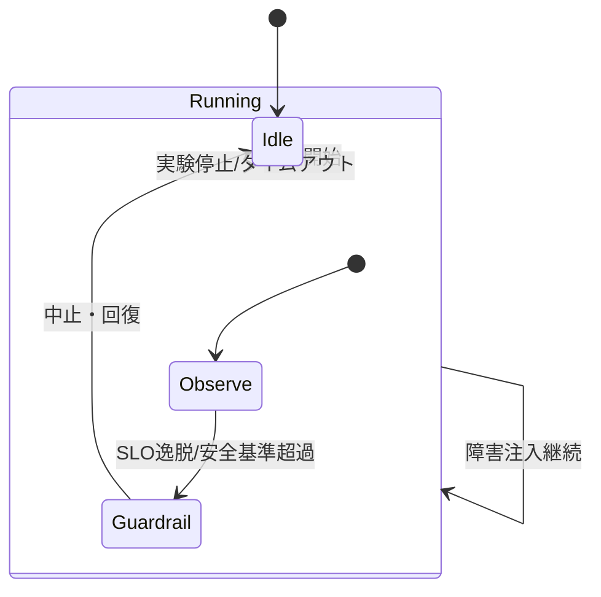

# 要件（EARS記法） - AKS Chaos Lab

実現すべき要件をEARS記法で定義する。

## スコープ
- 対象: AKS上で動作するFastAPIベースのWebサービス（Redis連携、可観測性対応）
- カオス注入: Azure Chaos Studio（AKS向けChaos Mesh capabilities）を用いる。アプリ内の/chaos系APIは提供しない。
- IaC: BicepでAKSクラスター、Azure Managed Redis、Application Insights、Log Analytics、Chaos Studio、Managed Prometheus等を構築
- 負荷試験: Locustベースのシナリオを継承しAKS環境で実行可能とする
	- 受入観点: エラー率と応答時間（p95目安<1s）の継続観測、失敗時のテレメトリ（Application Insights）での追跡が可能であること。

## 基本要件
- システムは常に `/health` でヘルスチェックに成功するものとする（依存サービスに問題がない通常時）。
- システムは常に `/` でRedisを用いた処理を実行し、成功時は200を返すものとする（`REDIS_ENABLED=true` のとき）。
- システムは常に OpenTelemetry によるトレース/メトリクス/ログを Application Insights へ送信できるものとする（設定により制御可能）。
- システムは常に Entra ID のユーザー割当マネージドIDを用いて Redis にパスワードレスで接続するものとする（AKS上では Workload Identity を使用）。
- システムは常に コンフィグは Kubernetes の ConfigMap/Secret で管理され、環境変数としてアプリに注入されるものとする（azd の Kustomize `env` で Bicep outputs を一時 `.env` に出力し、kustomize の ConfigMapGenerator（静的は `literals`、動的は `envs`）+ replacements で適用）。
- システムは aksSkuName が Base のとき、Kubernetesバージョンの更新は Azure Kubernetes Fleet Manager を使用し、手動承認制御により管理するものとする。
- システムは aksSkuName が Base のとき、Node OSイメージの更新は AKS ネイティブの自動アップグレード機能（`nodeOSUpgradeChannel=NodeImage`）を使用し、メンテナンスウィンドウ（毎週水曜日）で自動実行するものとする。
- システムは aksSkuName が Base のとき、Fleet 更新戦略の beforeGates に定義された承認（Approval Gate）が完了するまで Kubernetes バージョンのアップデートを開始しないものとする。
- システムは aksSkuName が Base のとき、Fleet の Manual Gate が Pending の場合に Azure Monitor アラート（`fleet-approval-pending`）を発火し、承認待ち状態を通知するものとする。
- システムは aksSkuName が Base のとき、Node OS 自動アップグレードが実行された場合に Azure Monitor アラート（`aks-nodeos-autoupgrade`）を発火し、アップグレード実行を通知するものとする。

## カオス注入（イベント/状態駆動）
- Chaos Studioの実験が開始されたとき、システムは [ネットワーク遮断] 発生時にRedis接続が失敗し適切なリトライ/タイムアウト/エラーハンドリングを行うものとする。
- Chaos Studioの実験が開始されたとき、システムは [CPUストレス/メモリ圧迫] 発生中でも健全性と可観測性を維持するものとする。
- Chaos Studioの実験が開始されたとき、システムは [Pod/コンテナKill・再起動] 発生時に適切に再起動し、Liveness/Readinessプローブにより安定化するものとする。
- Chaos Studioの実験が開始されたとき、システムは [I/O/ディスク遅延・エラー] に起因する遅延/失敗を適切に表面化し、テレメトリに記録するものとする。
- 障害注入が終了したとき、システムは [通常動作] に自動復帰するものとする。
- 対応キャパビリティは Pod/Network/Stress/IO/Time/HTTP/DNS（すべて v2.2）である（`infra/modules/chaos/experiments.bicep`）。KernelChaos は既知不具合により既定無効。

## カオス実験仕様（詳細）
以下は Azure Chaos Studio（AKS向け Chaos Mesh capabilities）で実行する実験の詳細仕様である。

共通事項:
- 対象セレクタ: `namespace=chaos-lab`, `label app=chaos-app`（デフォルト、Bicep 変数で上書き可）
- 既定時間: `PT2M`（Bicep `duration` で調整可能。短時間・低影響を原則）
- ガードレール: p95 レイテンシ 2x 以上の持続、5xx 率 > 5% が 30 秒続く場合は実験中止
- 観測: Application Insights（トレース/メトリクス/例外）、Managed Prometheus（WARメトリクス）、Kubernetes（Events/Pod再起動/HPA）

### 1) PodChaos（Pod Kill）
- EARS要件: 実験が実行中のとき、システムは 任意の1PodがKillされても自動再起動し、Readiness/Livenessにより 60 秒以内に安定化するものとする。
- 注入仕様（既定）: `action=pod-failure`, `mode=one`, `selector={ns: chaos-lab, label: app=chaos-app}`
- 受入基準: 5xx 率 ≤ 5%、p95 ≤ 2x、終了後 60 秒以内に通常水準へ回復、Pod再起動イベント記録あり
- 観測指標: `requests{status}` 分布、`pod_restart_count`、`/health` 成功、トレース例外なし

### 2) NetworkChaos（遅延）
- EARS要件: 実験が実行中のとき、システムは Redis へのネットワーク遅延が 200±50ms 加わってもタイムアウト/リトライにより致命的障害を回避し、サービス可用性を維持するものとする。
- 注入仕様（既定）: `action=delay`, `direction=to`, `latency=200ms`, `jitter=50ms`, `mode=all`
- 受入基準: `/` の 200 維持（必要に応じ 503 許容だが 5% 以下）、p95 ≤ 3x、終了後 60 秒以内に回復
- 観測指標: Redis 依存の失敗率、`redis_connection_latency_ms`、WAR レイテンシヒストグラム

#### 2b) NetworkChaos（停止/切断）
- EARS要件: 実験が実行中のとき、システムは 対象Podから Redis へのネットワークが停止（切断）されてもフェイルファストで 503 を返し、プロセスの安定性と可観測性を維持するものとする。
- 注入仕様（候補1: 完全切断）: `action=partition`, `direction=to`, `mode=all`, `target.selector={namespaces:[chaos-lab], labelSelectors:{app: chaos-app}}`
  - 備考: Chaos Mesh の partition により対象間の通信を遮断する（v2.2 仕様）。
- 注入仕様（候補2: ブラックホール）: `action=loss`, `loss=100%`, `direction=to`, `mode=all`
  - 備考: 100% パケットロスで実質的な停止を再現。
- 受入基準:
  - `/` は標準化エラー（503 + エラーレスポンス）でフェイルファスト、パニック/クラッシュなし
  - `/health` は Redis 有効時は 503 を適切に返す（無限待ち・ハングなし）
  - 実験終了後 60 秒以内に 200 へ回復（p95/5xx も通常水準へ）
  - ログ/トレースに依存失敗の記録が残る（例外の種類と回数）
- ガードレール適用: 本実験では 5xx 率は注入の意図上上昇するため、共通ガードレールの「5xx>5% 持続」は適用除外とし、クラッシュループや異常レイテンシのみ監視対象とする。

### 3) StressChaos（CPU/メモリ）
- EARS要件: 実験が実行中のとき、システムは CPU 80%・メモリ 256MB のストレスが 1Pod に与えられても、HPA によりスループットと可用性を維持するものとする。
- 注入仕様（既定）: `cpu.workers=1, load=80`, `memory.workers=1, size=256MB`, `mode=one`
- 受入基準: 5xx 率 ≤ 5%、HPA スケールが想定通り（あるいはスケール不要なら安定）、p95 ≤ 2.5x
- 観測指標: Pod CPU/メモリ、HPA Events、レスポンス時間分布

### 4) IOChaos（I/O 遅延）
- EARS要件: 実験が実行中のとき、システムは `/data` への I/O に 100ms 遅延が発生しても Web リクエストの安定動作を維持するものとする。
- 注入仕様（既定）: `action=latency`, `delay=100ms`, `percent=100`, `path=/data`, `mode=one`
- 受入基準: 5xx 率 ≤ 5%、p95 ≤ 2x、I/O 遅延期間中も `/health` は 200 を維持
- 観測指標: コンテナログ/例外、レスポンス時間分布
 - 注意: 本リポジトリのサンプルアプリケーションは `/data` を読み書きせず、I/O 自体が少ないため既定の IOChaos の影響が見えにくい。効果を確認したい場合は、アプリケーションに `/data` 配下の読み書き処理を追加することを推奨。

### 5) TimeChaos（時計ずれ）
- EARS要件: 実験が実行中のとき、システムは システム時刻を +300s 進めてもトレース/メトリクス送信が継続し、スケジューリングが破綻しないものとする。
- 注入仕様（既定）: `timeOffset=300s`, `clockIds=[CLOCK_REALTIME]`, `mode=one`
- 受入基準: テレメトリ送信継続、重大例外なし、終了後の時刻整合性回復
- 観測指標: App Insights 時刻整合性、例外ログ

### 6) KernelChaos（一時除外）
- Chaos Mesh の既知不具合により KernelChaos は当面の対象外です。詳細: https://github.com/chaos-mesh/chaos-mesh/issues/4059

### 7) HTTPChaos（HTTP 中断/改変）
- EARS要件: 実験が実行中のとき、システムは In-Pod HTTP リクエスト（ポート 8000 の GET /）が Abort されても健全性監視は維持されるものとする。
- 注入仕様（既定）: `target=Request`, `port=8000`, `method=GET`, `path=/`, `abort=true`, `mode=one`
- 受入基準: `/health` 維持、主要エンドポイントの可用性確保、終了後回復
- 観測指標: 5xx 率、/health 成功率

### 8) DNSChaos（名前解決失敗）
- EARS要件: 実験が実行中のとき、システムは `AZURE_REDIS_HOST`（具体的な FQDN）の DNS 失敗に対して適切に失敗を表面化し、リトライ/バックオフを行い可観測性を確保するものとする。
- 注入仕様（既定）: `action=error`, `patterns=[AZURE_REDIS_HOST]`, `scope=cluster`, `mode=all`
- 備考: Chaos Mesh の DNSChaos `patterns` はワイルドカード（`*`）を受け付けないため、具体的な FQDN を渡すこと（本リポでは Bicep から `redisHost` をモジュールへ渡す）。
- 受入基準: 503 へのフェイルファスト、5xx 率 ≤ 10%（短時間の尖りは許容）、終了後回復
- 観測指標: 依存関係失敗率、例外ログ、トレーススパン

## アプリ内障害APIの非提供
- システムは常に アプリケーション内の障害注入API（/chaos系）を提供しないものとする。障害注入は Azure Chaos Studio（AKS向け Chaos Mesh capabilities）に限定する。

## セキュリティ/ネットワーク
- システムは常に AKSクラスターとRedisはプライベート接続（VNet/PE）で通信するものとする。
- システムは常に ACRからのPullはマネージドIDで行うものとする。
- 望ましくない条件（認可されていないアクセス）が発生した場合、システムは 401/403と監査ログを返すものとする。

## 入口（Ingress）
- システムは常に Web Application Routing アドオンを有効化し、カスタムの `NginxIngressController` リソースを作成して使用するものとする（`k8s/base/nginx-ingress-controller.yaml`）。
- システムは常に `IngressClass` は `nginx-static` を使用し、アプリの `Ingress` は当該クラスを参照するものとする。
- システムは常に Ingress コントローラは Public LoadBalancer で外部公開され、静的IPアドレスが割り当てられるものとする。
- システムは常に Ingress 層で Prometheus 形式のメトリクス（リクエスト数、レイテンシ分布、ステータスコード別エラー率）をエクスポートするものとする。
- システムは常に Azure Monitor managed Prometheus（AMAのアノテーション・スクレイプ）により、Web Application Routing の Nginx メトリクスをホスト名ラベル付きで収集可能とするものとする。
- システムは常に Ingress コントローラは高可用（複数レプリカ）で稼働するものとする（明示的な副作用設定はマニフェストに含めない）。

- システムは常に bicep と Azure Developer CLI (azd) のみを用いて再現可能にプロビジョニング/デプロイできるものとする（GitHub Actionsは使用しない）。
- システムは常に 主要なパラメータ（スケール、トレースサンプリング、Redis設定）を環境変数で変更可能なものとする。
- システムは常に 負荷テストとカオス実験の自動実行手順が提供されるものとする。
- システムは常に BASE_URL が未指定のとき、azd 環境変数 `AZURE_INGRESS_FQDN` を用いて `http://<FQDN>` としてエンドポイントを自動構成できるものとする（未取得時は Ingress 自動検出にフォールバック）。
- システムは常に 30秒以内で完了するスモーク負荷プロファイル（例: USERS=5, SPAWN_RATE=2/s, DURATION=30s）を提供し、日常検証やCIで活用可能であるものとする。
- azd の `services` は `api`（アプリ）, `observability`（AMA設定の適用）, `chaos-mesh`（Helm）を含む。`hooks.predeploy` は不要。`services.api.k8s.kustomize.env` に `KEY: ${KEY}` のようにキー/値で列挙し、kustomize の replacements で `ServiceAccount` のクライアントID注入や Ingress/NginxIC の動的設定を適用する。

## エラーハンドリング
- 望ましくない条件（Redis接続エラー、タイムアウト）が発生した場合、システムは 標準化エラーレスポンスを返し、トレースに例外情報を記録するものとする。
- 望ましくない条件（アプリハング）が発生した場合、システムは Livenessプローブにより再起動されるものとする。

## 可観測性
- システムは常に 10% のトレースサンプリングを既定とし、環境変数で変更可能とする（`TELEMETRY_SAMPLING_RATE`）。
- システムは常に OpenTelemetry による自動計装（FastAPI/Redis/Logging）を行い、Application Insights へ直接送信する。
- システムは常に Redis 接続に関するカスタムメトリクスを公開する（`redis_connection_status`, `redis_connection_latency_ms`）。
- システムは常に Web Application Routing nginx のメトリクスエンドポイント（既定: `:10254/metrics`）を公開し、Pod アノテーション `prometheus.io/scrape: "true"`, `prometheus.io/port: "10254"`, `prometheus.io/path: "/metrics"` を設定するものとする。
- システムは常に SLO 監視に必要な指標（p95 レイテンシ、5xx 率）を Azure Monitor でクエリ・アラート定義可能とするものとする。

## 非機能
- システムは常に 正常時 p95応答時間が1秒未満を維持するものとする（参考値、負荷に応じて再評価）。
- システムは常に 主要エンドポイントと基本機能の自動テスト（ユニットテスト）が存在するものとする。統合テストは必要に応じて段階的に追加する。

## 依存/制約
- AKSのネットワークはAzure CNI Overlay + Cilium、Workload Identityを採用。
- Advanced Container Networkingアドオンを有効化し、L7ネットワークポリシーと可観測性を強化。
  - chaos-app への受信トラフィックは Ingress Controller 経由のみに制限すること（`k8s/base/networkpolicy.yaml`）。
  - 送信は Redis と App Insights、認証（`login.microsoftonline.com`）等に限定すること（`k8s/base/ciliumnetworkpolicy-egress-allowlist.yaml`）。
- Container Insights（Log Analytics連携）を有効化し、統合監視を実現。
- Chaos Studioのサポートされるターゲット/実験に限定する。
- AKSの `ingressProfile.webAppRouting.enabled` を有効化し、Web Application Routing アドオンを使用してカスタム NginxIngressController を管理する。
