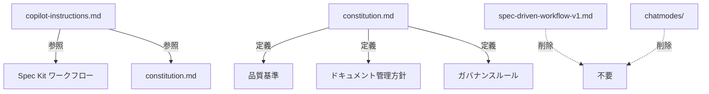

# Data Model: Spec Kit移行

**Date**: 2025-12-08  
**Feature**: 001-speckit-migration

## エンティティ定義

この機能はドキュメント・設定ファイルの移行であり、データベースエンティティは含まない。
以下は移行対象のファイルエンティティ。

### 1. Configuration Files（設定ファイル）

| ファイル | 変更種別 | 説明 |
|---------|---------|------|
| `.github/copilot-instructions.md` | 更新 | AIへの指示のみに簡素化 |
| `.specify/memory/constitution.md` | 更新 | プロジェクトのコア原則を定義 |
| `.github/prompts/spec-driven-workflow-v1.md` | 削除 | 旧ワークフローファイル |
| `.github/chatmodes/4.1-Beast.chatmode.md` | 削除 | 不要になったchatmode |
| `.github/chatmodes/` | 削除 | ディレクトリごと削除 |

### 2. File Relationships（ファイル関係）



### 3. copilot-instructions.md の新構造

```markdown
# 応答のスタイル
- 応答は日本語を使う。

# ファイル管理とプロジェクト構造
- ルートフォルダは必要最低限のファイル数に保つ
- ドキュメントはdocsディレクトリに配置
- 一時ファイルはtmpディレクトリに配置
- テストファイルはtestsディレクトリに配置

# ワークフロー
- Spec Kitワークフローに従う（/speckit.specify, /speckit.plan, /speckit.tasks, /speckit.implement）
- 詳細なルールは .specify/memory/constitution.md を参照
```

### 4. constitution.md の新構造

```markdown
# AKS Chaos Lab Constitution

## Core Principles

### I. 品質基準
- 型チェック: 0エラー必須
- リント: 0警告必須
- テスト: 全テスト合格必須

### II. ドキュメント管理
- /docs直下の主要ドキュメントを常に最新に保つ
- 図表はMermaid記法を使用
- 履歴的ドキュメントは/docs/history/に保存

### III. ガバナンス
- 各フェーズ間は承認ゲートを設ける
- 承認なしに次フェーズへ進まない

## Governance
- Constitutionはすべてのプラクティスに優先する
- 変更には文書化と承認が必要

**Version**: 1.0.0 | **Ratified**: 2025-12-08
```

## 状態遷移

該当なし（静的ファイルの移行のため）

## バリデーションルール

| ルール | 対象 | 検証方法 |
|-------|------|---------|
| 重複なし | copilot-instructions.md, constitution.md | 手動レビュー |
| 参照整合性 | copilot-instructions.md → constitution.md | リンク確認 |
| 削除完了 | 旧ファイル群 | ファイル存在確認 |
